# AI Inference Pipeline Architecture - Shard 3

**Component:** AI Inference Engine
**Version:** 1.0
**Related Shard:** [Shard_3_AI_Inference_Pipeline.md](../Implementation_Shards/Shard_3_AI_Inference_Pipeline.md)

---

## Table of Contents

1. [Overview](#overview)
2. [AI Pipeline Architecture](#ai-pipeline-architecture)
3. [Context Engineering Strategy](#context-engineering-strategy)
4. [Prompt Design](#prompt-design)
5. [Few-Shot Learning System](#few-shot-learning-system)
6. [Confidence Scoring](#confidence-scoring)
7. [Response Processing](#response-processing)
8. [Error Handling](#error-handling)
9. [Performance Optimization](#performance-optimization)

---

## Overview

The AI Inference Pipeline is the core intelligence layer that analyzes student data and generates skill assessments using OpenAI's GPT-4 model. The system employs context engineering with few-shot learning rather than fine-tuning, enabling rapid iteration and continuous improvement through teacher corrections.

**Key Capabilities:**
- Multi-skill assessment from single data entries
- Evidence-based justifications with source quotes
- Confidence scoring for quality assurance
- Adaptive learning from teacher corrections
- Support for 7 data types across 17 skills

---

## AI Pipeline Architecture

### High-Level Pipeline Flow

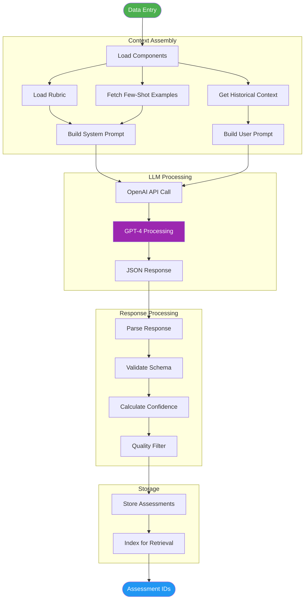

### Component Architecture

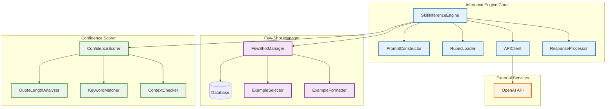

---

## Context Engineering Strategy

### Why Context Engineering Over Fine-Tuning

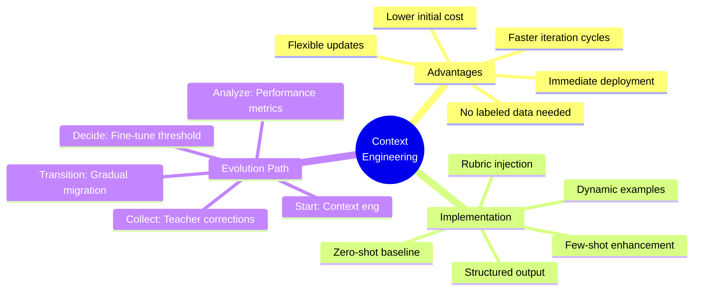

### Context Components

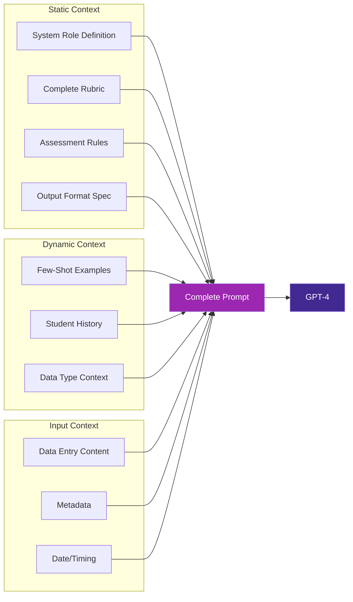

---

## Prompt Design

### System Prompt Structure

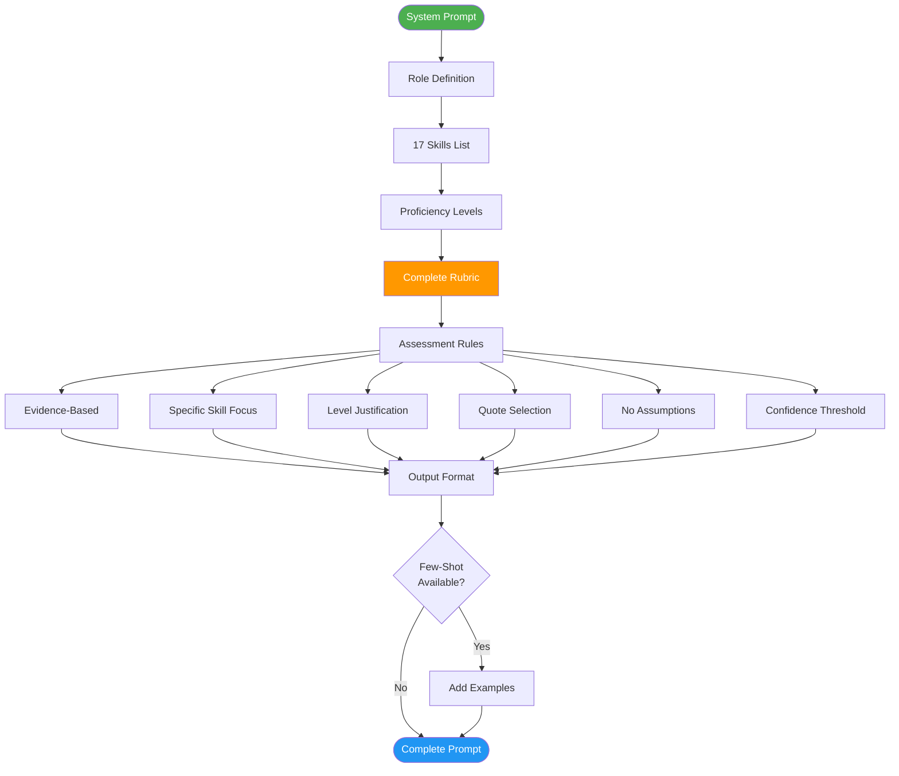

### System Prompt Template

```python
SYSTEM_PROMPT_TEMPLATE = """You are an Expert Educational Assessor specializing in middle school non-academic skill development. Your task is to analyze student data (transcripts, notes, reflections, feedback) and assess proficiency levels for specific skills based on a comprehensive behavioral rubric.

# YOUR ROLE
- Objective and unbiased
- Focus on observable behaviors, not assumptions
- Provide specific evidence for every assessment
- Use the EXACT proficiency levels defined in the rubric

# THE 17 SKILLS YOU ASSESS

## SEL (Social-Emotional Learning) - 5 Skills
1. Self-Awareness
2. Self-Management
3. Social Awareness
4. Relationship Skills
5. Responsible Decision-Making

## EF (Executive Function) - 6 Skills
6. Working Memory
7. Flexible Thinking
8. Self-Control
9. Task Initiation
10. Planning & Prioritization
11. Organization

## 21st Century Skills - 6 Skills
12. Communication
13. Collaboration
14. Critical Thinking
15. Creativity
16. Digital Literacy
17. Metacognition

# PROFICIENCY LEVELS
- **Emerging (E):** Needs significant, consistent support; skill application is inconsistent or absent.
- **Developing (D):** Applies the skill with frequent prompting or scaffolding; inconsistent success.
- **Proficient (P):** Applies the skill independently and consistently in familiar contexts; generally successful.
- **Advanced (A):** Applies the skill flexibly and strategically in novel or challenging contexts; models the skill for others.

# COMPLETE RUBRIC
{rubric_content}

# ASSESSMENT RULES
1. **Evidence-Based:** Every assessment MUST include a direct quote from the source material.
2. **Specific Skill Focus:** Assess ONLY the skills that have observable evidence in the data.
3. **Level Justification:** Explain WHY the student is at that level using rubric criteria.
4. **Quote Selection:** Choose the MOST representative quote (1-3 sentences) that demonstrates the behavior.
5. **No Assumptions:** Do not infer beyond what is observable in the text.
6. **Confidence Threshold:** If there is insufficient evidence to assess a skill, do not include it in your response.

# OUTPUT FORMAT
Return your assessment as a JSON array with the following structure:

```json
[
  {{
    "skill_name": "Self-Awareness",
    "skill_category": "SEL",
    "level": "Developing",
    "confidence_score": 0.85,
    "justification": "The student can name basic emotions when prompted and is beginning to connect feelings to behavior. In the transcript, the student says 'I was feeling frustrated because...' after being asked by the teacher to reflect. This demonstrates D-level self-awareness: naming emotions with prompting.",
    "source_quote": "I was feeling frustrated because the group wasn't listening to my ideas, and that made me want to just stop participating.",
    "data_point_count": 1
  }}
]
```

# FEW-SHOT EXAMPLES
{few_shot_examples}

Now, analyze the following student data and provide assessments for ALL observable skills.
"""
```

### User Prompt Template

```python
USER_PROMPT_TEMPLATE = """
# STUDENT DATA TO ANALYZE

**Student ID:** {student_id}
**Type:** {data_type}
**Date:** {date}
**Context:** {context}

**Content:**
{content}

---

Please assess all observable skills based on this data. Return ONLY the JSON array, no additional text.
"""
```

### Prompt Engineering Best Practices

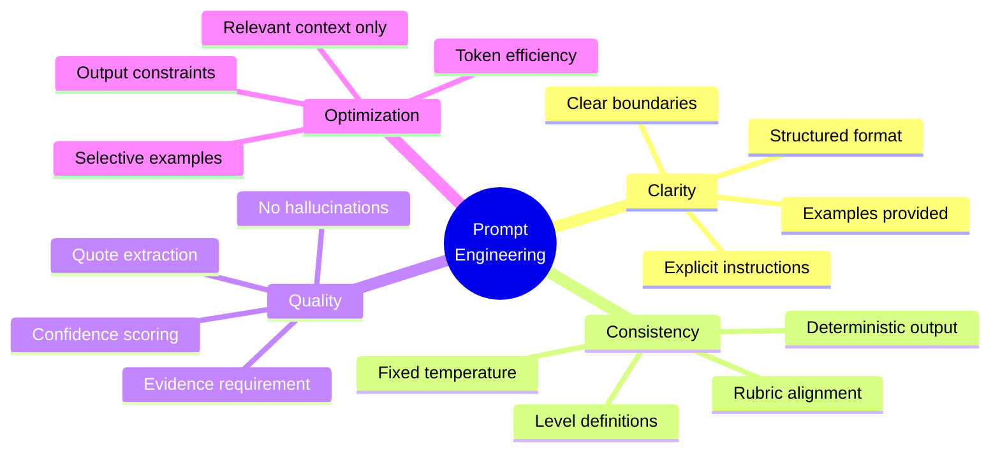

---

## Few-Shot Learning System

### Learning Loop Architecture

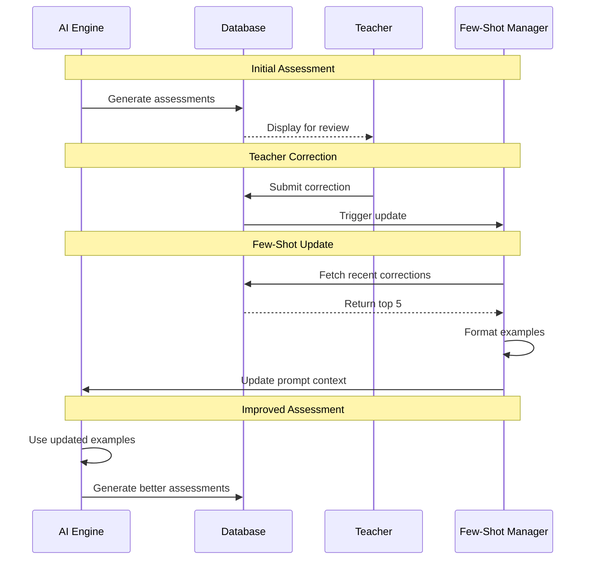

### Example Selection Strategy

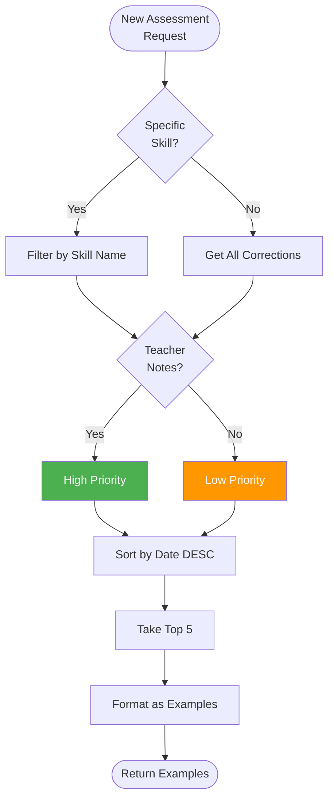

### Few-Shot Example Format

```python
class FewShotExample:
    """Structure for few-shot learning examples."""

    def __init__(
        self,
        skill_name: str,
        skill_category: str,
        level: str,
        justification: str,
        source_quote: str,
        teacher_notes: str = None,
        original_content: str = None
    ):
        self.skill_name = skill_name
        self.skill_category = skill_category
        self.level = level
        self.justification = justification
        self.source_quote = source_quote
        self.teacher_notes = teacher_notes
        self.original_content = original_content

    def to_prompt_format(self) -> str:
        """Convert to few-shot prompt format."""
        example = f"""
**Example - {self.skill_name} ({self.level})**

Original Data Excerpt:
"{self.source_quote}"

Assessment:
- Skill: {self.skill_name} ({self.skill_category})
- Level: {self.level}
- Justification: {self.justification}
"""
        if self.teacher_notes:
            example += f"\nTeacher Note: {self.teacher_notes}\n"

        return example
```

### Few-Shot Performance Metrics

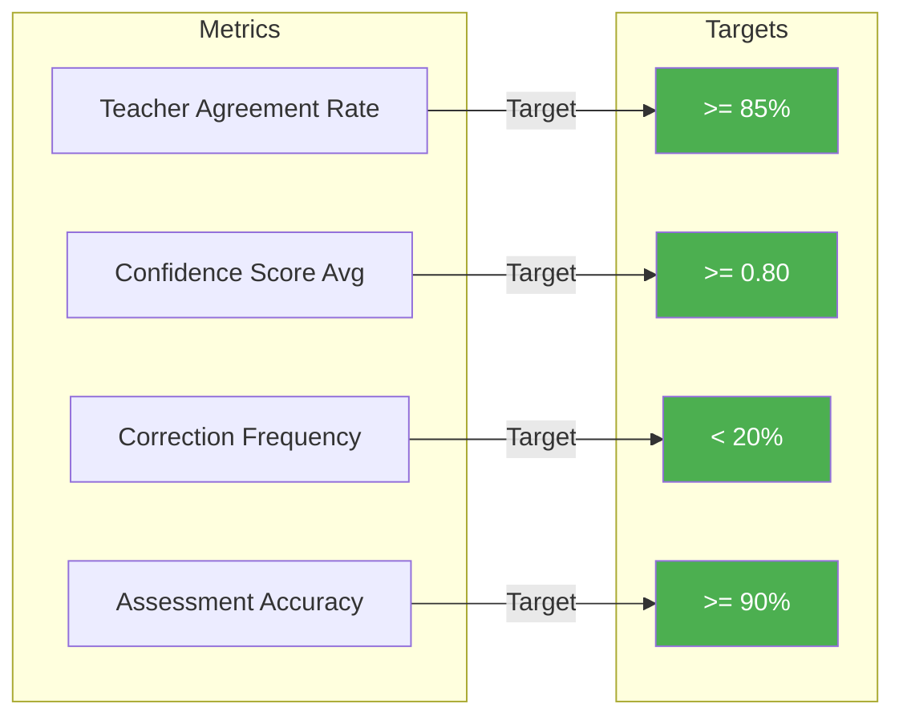

---

## Confidence Scoring

### Confidence Calculation Algorithm

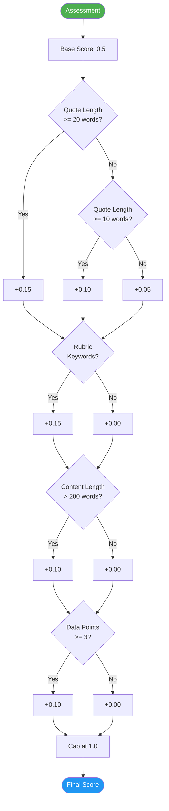

### Confidence Score Implementation

```python
def calculate_confidence_score(
    data_entry: Dict[str, Any],
    assessment: Dict[str, Any]
) -> float:
    """
    Calculate confidence score based on data quality indicators.

    Factors:
    - Quote length and specificity
    - Data entry length
    - Alignment with rubric language
    - Historical data availability

    Returns:
        float: Confidence score between 0.0 and 1.0
    """
    confidence = 0.5  # Base confidence

    # Factor 1: Source quote length (longer quotes = clearer evidence)
    quote_words = len(assessment['source_quote'].split())
    if quote_words >= 20:
        confidence += 0.15
    elif quote_words >= 10:
        confidence += 0.10
    else:
        confidence += 0.05

    # Factor 2: Rubric keyword matching
    rubric_keywords = [
        'independently', 'consistently', 'with prompting',
        'struggles to', 'demonstrates', 'applies', 'shows'
    ]
    justification_lower = assessment['justification'].lower()
    if any(keyword in justification_lower for keyword in rubric_keywords):
        confidence += 0.15

    # Factor 3: Data entry completeness
    content_words = len(data_entry['content'].split())
    if content_words > 200:
        confidence += 0.10

    # Factor 4: Historical data point count
    if assessment.get('data_point_count', 1) >= 3:
        confidence += 0.10

    # Cap at 1.0
    return min(confidence, 1.0)
```

### Confidence Interpretation

| Score Range | Interpretation | Action |
|-------------|---------------|--------|
| 0.90 - 1.00 | Very High | Auto-approve possible |
| 0.80 - 0.89 | High | Minimal review needed |
| 0.65 - 0.79 | Medium | Teacher review recommended |
| 0.50 - 0.64 | Low | Teacher review required |
| < 0.50 | Very Low | Flag for manual assessment |

---

## Response Processing

### Response Validation Pipeline

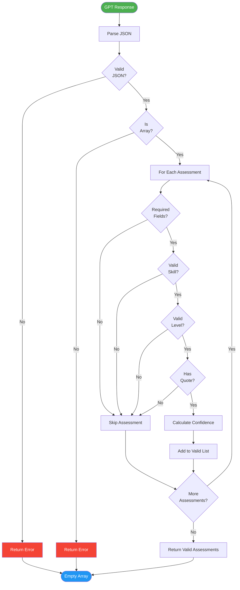

### Schema Validation

```python
from pydantic import BaseModel, Field, validator
from typing import Literal

class AssessmentResponse(BaseModel):
    """Schema for AI-generated assessment response."""

    skill_name: str = Field(..., min_length=1)
    skill_category: Literal["SEL", "EF", "21st_Century"]
    level: Literal["Emerging", "Developing", "Proficient", "Advanced"]
    confidence_score: float = Field(..., ge=0.0, le=1.0)
    justification: str = Field(..., min_length=10)
    source_quote: str = Field(..., min_length=5)
    data_point_count: int = Field(default=1, ge=1)

    @validator('skill_name')
    def validate_skill_name(cls, v):
        """Validate skill name against known skills."""
        valid_skills = [
            'Self-Awareness', 'Self-Management', 'Social Awareness',
            'Relationship Skills', 'Responsible Decision-Making',
            'Working Memory', 'Flexible Thinking', 'Self-Control',
            'Task Initiation', 'Planning & Prioritization', 'Organization',
            'Communication', 'Collaboration', 'Critical Thinking',
            'Creativity', 'Digital Literacy', 'Metacognition'
        ]
        if v not in valid_skills:
            raise ValueError(f"Invalid skill name: {v}")
        return v

    @validator('justification')
    def validate_justification(cls, v):
        """Ensure justification references the rubric."""
        if len(v.split()) < 10:
            raise ValueError("Justification too short")
        return v
```

---

## Error Handling

### Error Classification

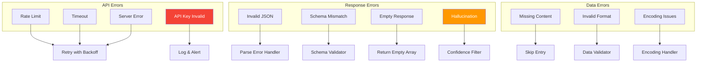

### Retry Strategy

```python
import time
from functools import wraps

def retry_with_exponential_backoff(
    max_retries: int = 3,
    initial_delay: float = 1.0,
    max_delay: float = 60.0
):
    """Decorator for retrying API calls with exponential backoff."""

    def decorator(func):
        @wraps(func)
        def wrapper(*args, **kwargs):
            delay = initial_delay

            for attempt in range(max_retries):
                try:
                    return func(*args, **kwargs)
                except openai.error.RateLimitError:
                    if attempt == max_retries - 1:
                        raise
                    time.sleep(delay)
                    delay = min(delay * 2, max_delay)
                except openai.error.APIError as e:
                    if attempt == max_retries - 1:
                        raise
                    time.sleep(delay)
                    delay = min(delay * 2, max_delay)

        return wrapper
    return decorator
```

---

## Performance Optimization

### Optimization Strategies

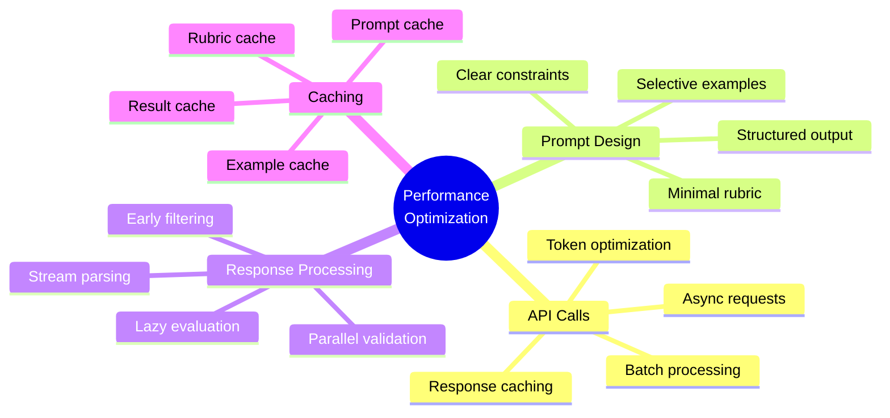

### Performance Metrics

| Metric | Target | Current | Strategy |
|--------|--------|---------|----------|
| API Call Duration | < 3s | ~4s | Optimize prompt length |
| Token Usage | < 2000 | ~2500 | Reduce rubric size |
| Response Parsing | < 100ms | ~80ms | ✓ Target met |
| End-to-End Time | < 5s | ~6s | Async processing |
| Cost per Assessment | < $0.02 | $0.025 | Batch requests |

---

## Integration Points

### AI Engine Integration Map

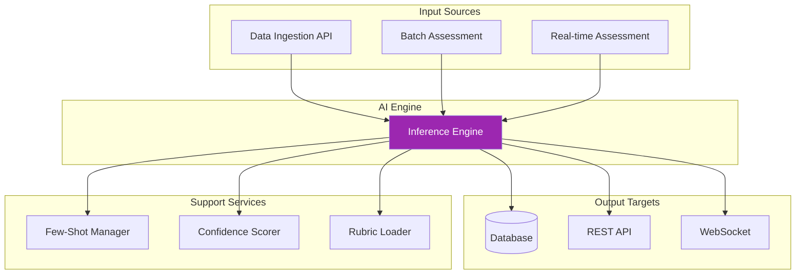

---

**Related Documents:**
- [Main Architecture Overview](./ARCHITECTURE_OVERVIEW.md)
- [Shard 3 Implementation Tasks](../Implementation_Shards/Shard_3_Tasks.md)
- [PRD AI Section](../Docs/PRD.md#4-ai-inference-pipeline)
