# Backend API Architecture - Shard 4

**Component:** FastAPI Backend
**Version:** 1.0
**Related Shard:** [Shard_4_Backend_API.md](../Implementation_Shards/Shard_4_Backend_API.md)

---

## Table of Contents

1. [Overview](#overview)
2. [API Architecture](#api-architecture)
3. [Endpoint Specifications](#endpoint-specifications)
4. [Request/Response Patterns](#requestresponse-patterns)
5. [Middleware & Security](#middleware--security)
6. [Error Handling](#error-handling)
7. [Data Validation](#data-validation)
8. [Performance Considerations](#performance-considerations)

---

## Overview

The FastAPI backend serves as the central API layer, coordinating between the frontend dashboards, AI inference engine, and PostgreSQL database. It provides RESTful endpoints for data ingestion, assessment retrieval, teacher corrections, and student progress tracking.

**Key Features:**
- RESTful API design
- Automatic OpenAPI documentation
- Pydantic data validation
- CORS support for Streamlit
- Async request handling
- Connection pooling

---

## API Architecture

### Layer Architecture

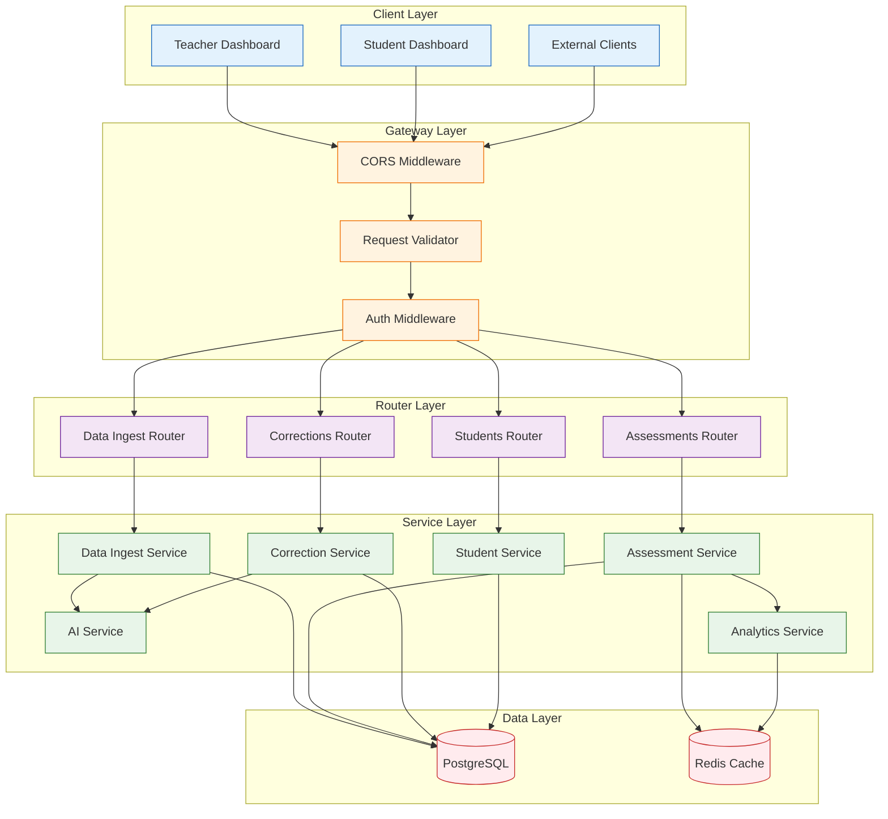

### Application Structure

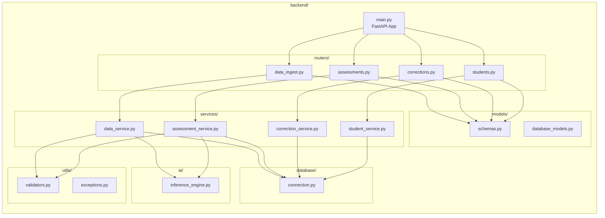

---

## Endpoint Specifications

### API Endpoint Map

```mermaid
graph TB
    Root[API Root /]

    subgraph "Health Endpoints"
        H1[GET /health]
        H2[GET /]
    end

    subgraph "Data Endpoints"
        D1[POST /api/data/ingest]
        D2[POST /api/data/batch]
        D3[GET /api/data/types]
    end

    subgraph "Assessment Endpoints"
        A1[GET /api/assessments/student/:id]
        A2[GET /api/assessments/skill-trends/:id]
        A3[GET /api/assessments/pending]
        A4[POST /api/assessments/:id/approve]
        A5[GET /api/assessments/:id]
    end

    subgraph "Correction Endpoints"
        C1[POST /api/corrections/submit]
        C2[GET /api/corrections/history/:student_id]
        C3[GET /api/corrections/stats]
    end

    subgraph "Student Endpoints"
        S1[GET /api/students]
        S2[GET /api/students/:id]
        S3[GET /api/students/:id/progress]
        S4[GET /api/students/:id/badges]
        S5[POST /api/students/:id/target-skill]
        S6[GET /api/students/:id/targets]
    end

    Root --> H1
    Root --> H2
    Root --> D1
    Root --> D2
    Root --> D3
    Root --> A1
    Root --> A2
    Root --> A3
    Root --> A4
    Root --> A5
    Root --> C1
    Root --> C2
    Root --> C3
    Root --> S1
    Root --> S2
    Root --> S3
    Root --> S4
    Root --> S5
    Root --> S6

    classDef health fill:#4caf50,color:#fff
    classDef data fill:#2196f3,color:#fff
    classDef assessment fill:#9c27b0,color:#fff
    classDef correction fill:#ff9800,color:#fff
    classDef student fill:#f44336,color:#fff

    class H1,H2 health
    class D1,D2,D3 data
    class A1,A2,A3,A4,A5 assessment
    class C1,C2,C3 correction
    class S1,S2,S3,S4,S5,S6 student
```

### Detailed Endpoint Specifications

#### 1. Health Endpoints

##### GET /
```yaml
summary: Root endpoint
description: Returns API information and status
responses:
  200:
    content:
      application/json:
        schema:
          type: object
          properties:
            message: string
            version: string
            status: string
```

##### GET /health
```yaml
summary: Health check endpoint
description: Returns system health status
responses:
  200:
    content:
      application/json:
        schema:
          type: object
          properties:
            status: string
            database: string
            ai_service: string
            timestamp: string
```

#### 2. Data Ingest Endpoints

##### POST /api/data/ingest
```yaml
summary: Ingest single data entry
description: Ingest a data entry and trigger AI assessment
requestBody:
  content:
    application/json:
      schema:
        type: object
        required:
          - data_entry_id
          - student_id
          - type
          - date
          - content
        properties:
          data_entry_id: string
          student_id: string
          teacher_id: string
          type: string
          date: string (YYYY-MM-DD)
          content: string
          metadata: object
responses:
  200:
    content:
      application/json:
        schema:
          type: object
          properties:
            data_entry_id: string
            assessments_created: integer
            assessment_ids: array
            status: string
  400:
    description: Invalid request data
  500:
    description: Server error
```

##### POST /api/data/batch
```yaml
summary: Batch ingest multiple data entries
description: Ingest multiple data entries efficiently
requestBody:
  content:
    application/json:
      schema:
        type: object
        properties:
          entries: array of data_entry objects
responses:
  200:
    content:
      application/json:
        schema:
          type: object
          properties:
            total_entries: integer
            successful: integer
            failed: integer
            results: array
```

#### 3. Assessment Endpoints

##### GET /api/assessments/student/{student_id}
```yaml
summary: Get all assessments for a student
parameters:
  - name: student_id
    in: path
    required: true
    schema:
      type: string
  - name: skill_name
    in: query
    schema:
      type: string
  - name: date_from
    in: query
    schema:
      type: string
  - name: date_to
    in: query
    schema:
      type: string
responses:
  200:
    content:
      application/json:
        schema:
          type: object
          properties:
            student_id: string
            total_assessments: integer
            assessments: array
```

##### GET /api/assessments/skill-trends/{student_id}
```yaml
summary: Get skill progression trends
description: Returns time-series data for skill visualization
parameters:
  - name: student_id
    in: path
    required: true
responses:
  200:
    content:
      application/json:
        schema:
          type: object
          properties:
            student_id: string
            skills: array
              - skill_name: string
                skill_category: string
                trend: array
                  - date: string
                    level: string
                    level_numeric: integer
                current_level: string
                growth_direction: string
```

##### GET /api/assessments/pending
```yaml
summary: Get pending assessments for review
description: Returns assessments that need teacher validation
parameters:
  - name: confidence_threshold
    in: query
    schema:
      type: number
      default: 0.8
  - name: teacher_id
    in: query
    schema:
      type: string
responses:
  200:
    content:
      application/json:
        schema:
          type: array
          items:
            type: object
```

#### 4. Correction Endpoints

##### POST /api/corrections/submit
```yaml
summary: Submit teacher correction
description: Submit a correction for an assessment
requestBody:
  content:
    application/json:
      schema:
        type: object
        required:
          - assessment_id
          - corrected_level
          - corrected_by
        properties:
          assessment_id: integer
          corrected_level: string
          corrected_justification: string
          teacher_notes: string
          corrected_by: string
responses:
  200:
    content:
      application/json:
        schema:
          type: object
          properties:
            correction_id: integer
            status: string
            message: string
```

#### 5. Student Endpoints

##### GET /api/students/{student_id}/progress
```yaml
summary: Get student progress data
description: Returns comprehensive progress information for student dashboard
parameters:
  - name: student_id
    in: path
    required: true
responses:
  200:
    content:
      application/json:
        schema:
          type: object
          properties:
            student_id: string
            student_name: string
            skills: array
              - skill_name: string
                current_level: string
                recently_advanced: boolean
                level_history: array
```

##### GET /api/students/{student_id}/badges
```yaml
summary: Get earned badges
description: Returns badges earned by the student
parameters:
  - name: student_id
    in: path
    required: true
responses:
  200:
    content:
      application/json:
        schema:
          type: object
          properties:
            student_id: string
            total_badges: integer
            badges: array
              - badge_id: integer
                skill_name: string
                earned_date: string
                level_achieved: string
                badge_icon: string
```

---

## Request/Response Patterns

### Standard Request Flow

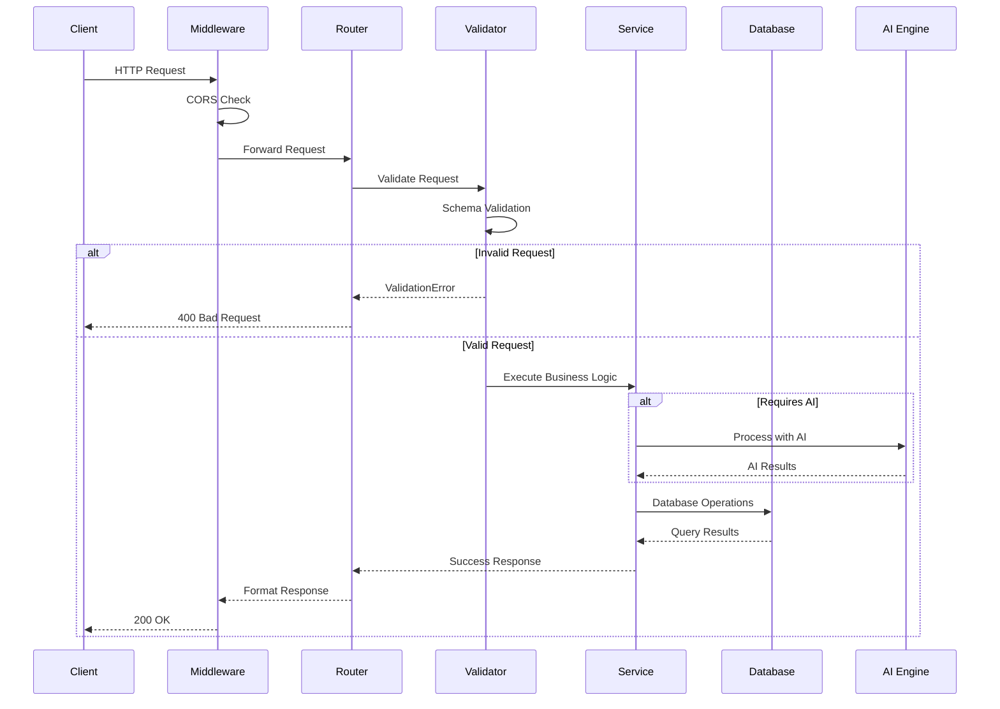

### Error Response Flow

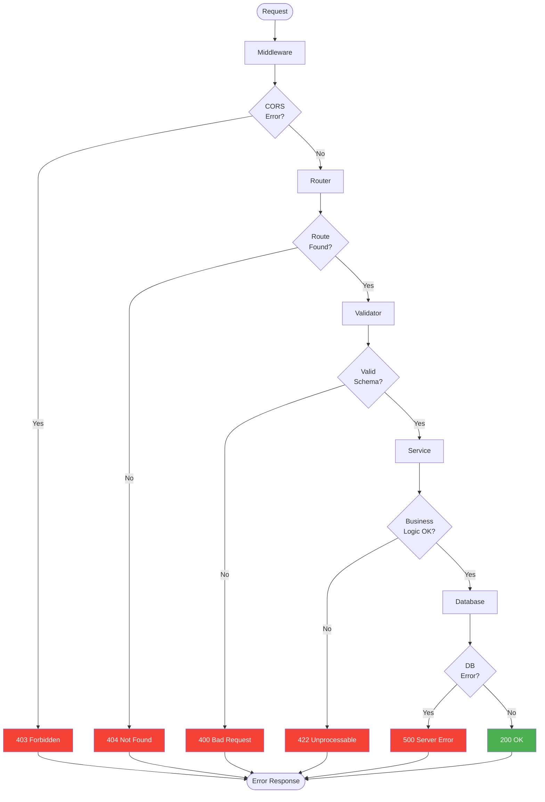

---

## Middleware & Security

### Middleware Stack

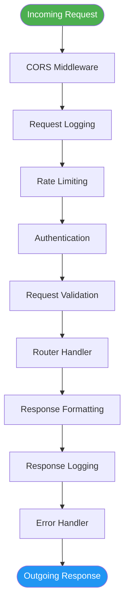

### CORS Configuration

```python
from fastapi.middleware.cors import CORSMiddleware

app.add_middleware(
    CORSMiddleware,
    allow_origins=[
        "http://localhost:8501",  # Streamlit default
        "http://frontend:8501",   # Docker internal
        "*"                        # Development only
    ],
    allow_credentials=True,
    allow_methods=["*"],
    allow_headers=["*"],
)
```

### Security Checklist

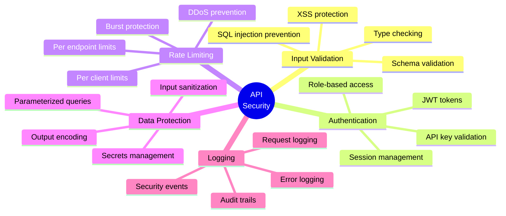

---

## Error Handling

### Error Response Structure

```python
from pydantic import BaseModel
from typing import Optional, List

class ErrorDetail(BaseModel):
    """Detailed error information."""
    field: Optional[str] = None
    message: str
    type: str

class ErrorResponse(BaseModel):
    """Standard error response format."""
    error: str
    detail: str
    status_code: int
    errors: Optional[List[ErrorDetail]] = None
    timestamp: str
```

### HTTP Status Codes

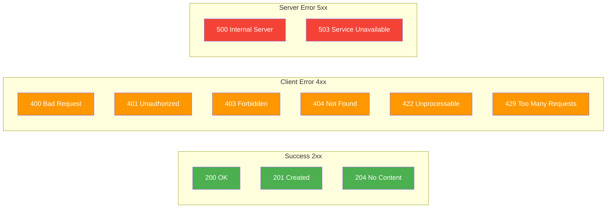

### Custom Exception Handler

```python
from fastapi import FastAPI, Request
from fastapi.responses import JSONResponse
from datetime import datetime

@app.exception_handler(Exception)
async def global_exception_handler(request: Request, exc: Exception):
    """Global exception handler for all uncaught exceptions."""
    return JSONResponse(
        status_code=500,
        content={
            "error": "Internal Server Error",
            "detail": str(exc),
            "status_code": 500,
            "timestamp": datetime.utcnow().isoformat(),
            "path": str(request.url)
        }
    )

@app.exception_handler(ValidationError)
async def validation_exception_handler(request: Request, exc: ValidationError):
    """Handler for Pydantic validation errors."""
    return JSONResponse(
        status_code=422,
        content={
            "error": "Validation Error",
            "detail": "Request validation failed",
            "status_code": 422,
            "errors": exc.errors(),
            "timestamp": datetime.utcnow().isoformat()
        }
    )
```

---

## Data Validation

### Pydantic Models

```python
from pydantic import BaseModel, Field, validator
from typing import Optional, Dict, Any, Literal
from datetime import date

class DataEntryRequest(BaseModel):
    """Request model for data ingestion."""

    data_entry_id: str = Field(..., regex=r'^DE[0-9]{3,}$')
    student_id: str = Field(..., regex=r'^S[0-9]{3}$')
    teacher_id: Optional[str] = Field(None, regex=r'^T[0-9]{3}$')
    type: Literal[
        'group_discussion_transcript',
        'peer_tutoring_transcript',
        'project_presentation_transcript',
        'reflection_journal',
        'peer_feedback',
        'teacher_observation_note',
        'parent_note'
    ]
    date: date
    content: str = Field(..., min_length=10)
    metadata: Optional[Dict[str, Any]] = {}

    @validator('content')
    def content_not_empty(cls, v):
        if not v.strip():
            raise ValueError('Content cannot be empty')
        return v

class AssessmentResponse(BaseModel):
    """Response model for assessments."""

    id: int
    data_entry_id: str
    student_id: str
    skill_name: str
    skill_category: Literal['SEL', 'EF', '21st_Century']
    level: Literal['Emerging', 'Developing', 'Proficient', 'Advanced']
    confidence_score: float = Field(..., ge=0.0, le=1.0)
    justification: str
    source_quote: str
    created_at: str
    corrected: bool = False

class CorrectionRequest(BaseModel):
    """Request model for teacher corrections."""

    assessment_id: int
    corrected_level: Literal['Emerging', 'Developing', 'Proficient', 'Advanced']
    corrected_justification: Optional[str] = None
    teacher_notes: Optional[str] = None
    corrected_by: str = Field(..., regex=r'^T[0-9]{3}$')

    @validator('teacher_notes')
    def notes_required_for_changes(cls, v, values):
        if v is None or not v.strip():
            raise ValueError('Teacher notes required for corrections')
        return v
```

### Validation Flow

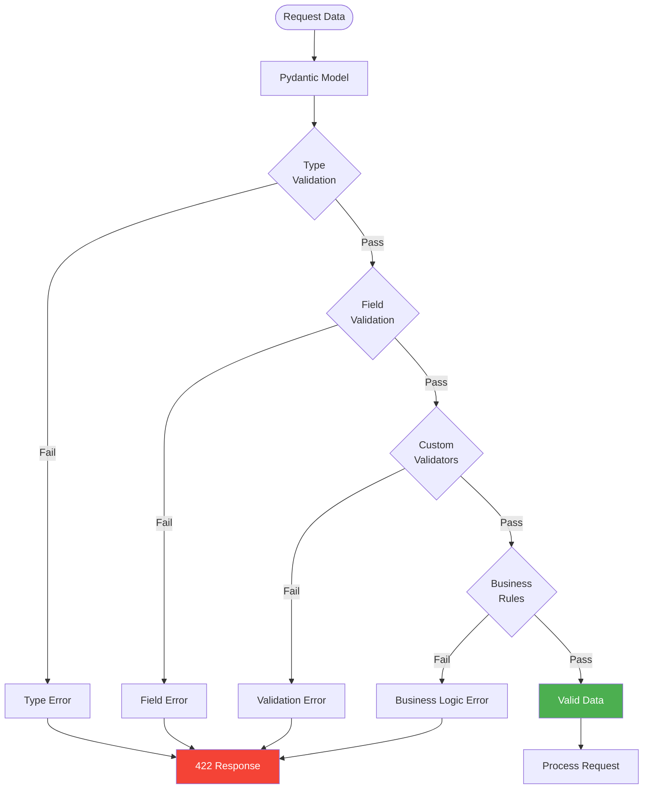

---

## Performance Considerations

### Performance Optimization Strategy

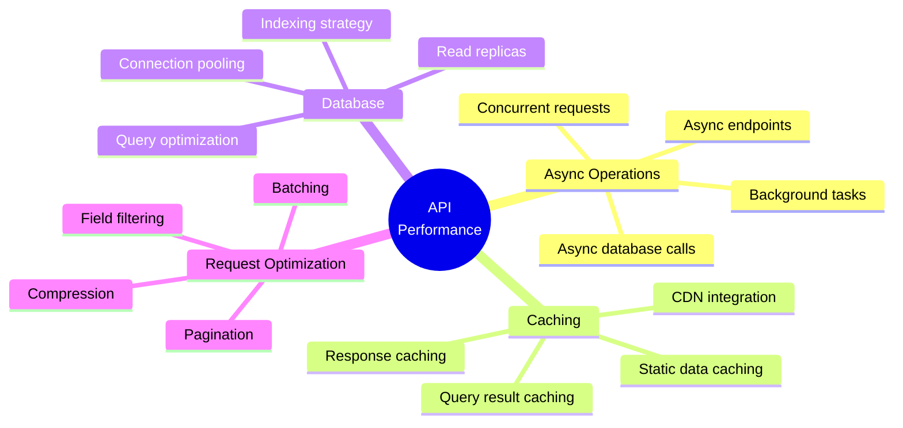

### Performance Metrics

| Endpoint Type | Target Latency | Current | Optimization |
|--------------|----------------|---------|--------------|
| Health Check | < 50ms | ~30ms | ✓ Target met |
| Data Ingest | < 5s | ~6s | Async AI calls |
| Assessment Query | < 200ms | ~150ms | ✓ Target met |
| Skill Trends | < 500ms | ~400ms | ✓ Target met |
| Batch Operations | < 10s | ~12s | Parallel processing |

### Caching Strategy

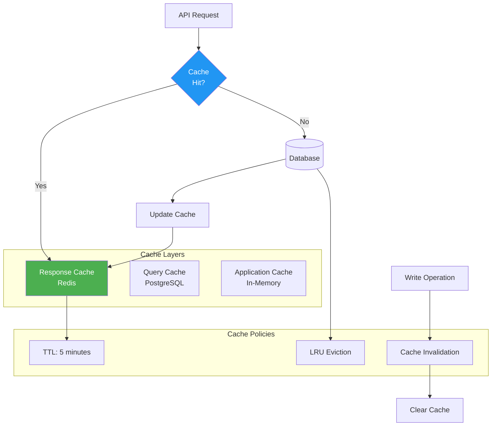

---

## Integration Examples

### FastAPI Application Setup

```python
from fastapi import FastAPI
from fastapi.middleware.cors import CORSMiddleware
import logging

# Initialize FastAPI app
app = FastAPI(
    title="Flourish Skills Tracker API",
    version="1.0.0",
    description="API for AI-powered non-academic skills assessment"
)

# Configure CORS
app.add_middleware(
    CORSMiddleware,
    allow_origins=["*"],
    allow_credentials=True,
    allow_methods=["*"],
    allow_headers=["*"],
)

# Configure logging
logging.basicConfig(level=logging.INFO)
logger = logging.getLogger(__name__)

# Include routers
from routers import data_ingest, assessments, corrections, students

app.include_router(data_ingest.router, prefix="/api/data", tags=["Data"])
app.include_router(assessments.router, prefix="/api/assessments", tags=["Assessments"])
app.include_router(corrections.router, prefix="/api/corrections", tags=["Corrections"])
app.include_router(students.router, prefix="/api/students", tags=["Students"])

@app.on_event("startup")
async def startup_event():
    """Initialize services on startup."""
    logger.info("Starting Flourish Skills Tracker API")
    # Initialize database pool
    from database.connection import db_pool
    db_pool.initialize()

@app.on_event("shutdown")
async def shutdown_event():
    """Cleanup on shutdown."""
    logger.info("Shutting down Flourish Skills Tracker API")
    from database.connection import db_pool
    db_pool.close_all()

@app.get("/")
async def root():
    return {
        "message": "Flourish Skills Tracker API v1.0",
        "status": "operational",
        "docs": "/docs"
    }

@app.get("/health")
async def health_check():
    return {
        "status": "healthy",
        "database": "connected",
        "timestamp": datetime.utcnow().isoformat()
    }
```

---

**Related Documents:**
- [Main Architecture Overview](./ARCHITECTURE_OVERVIEW.md)
- [Shard 4 Implementation Tasks](../Implementation_Shards/Shard_4_Tasks.md)
- [PRD API Section](../Docs/PRD.md#5-api-endpoints)
