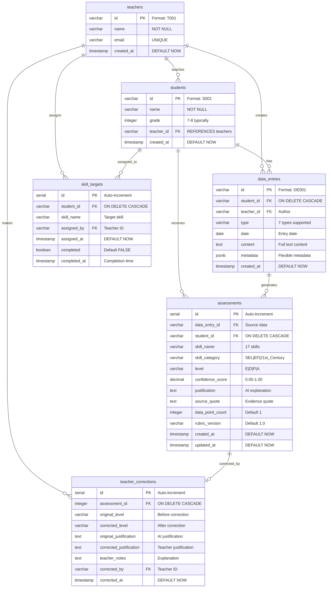
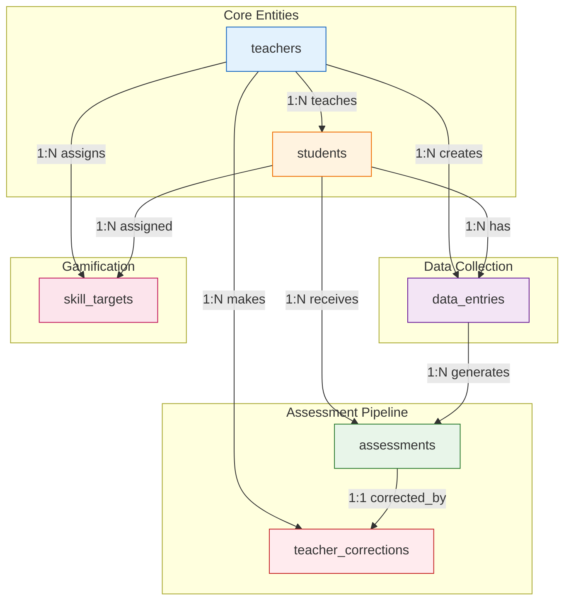
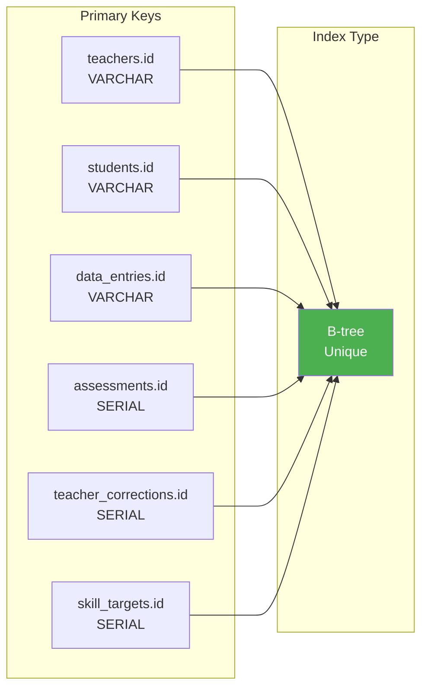
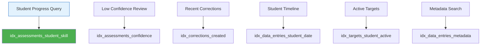
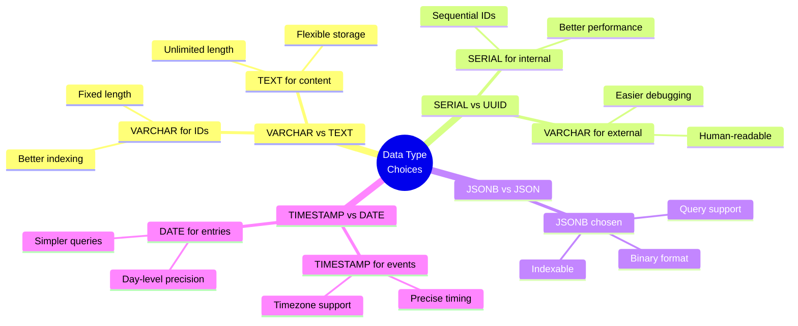
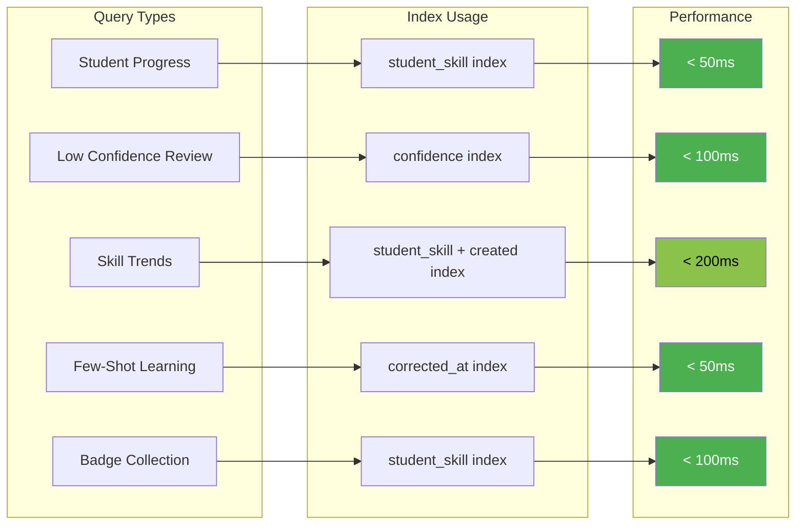
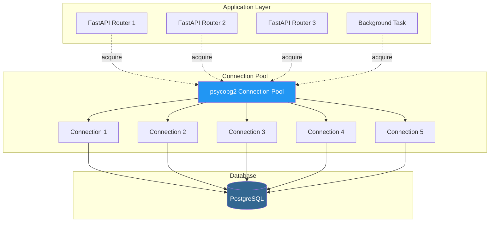
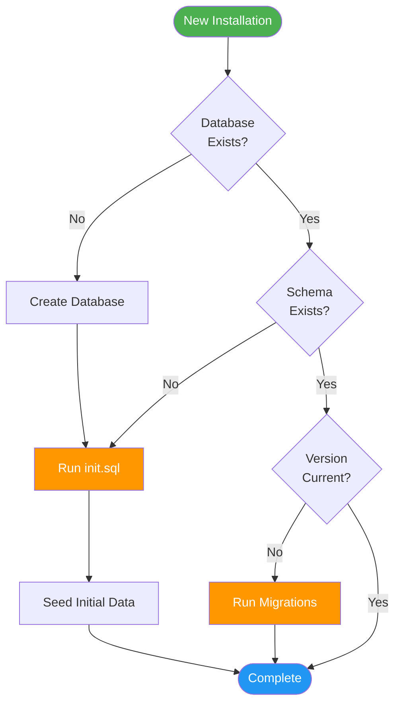
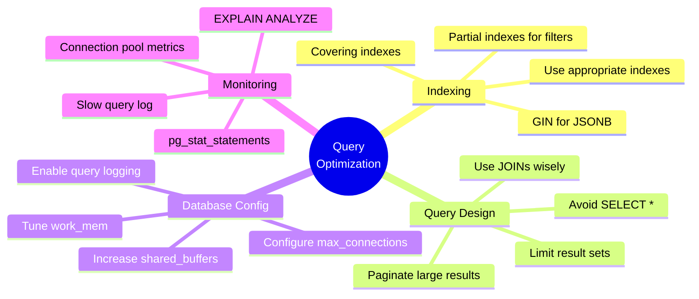

# Database Architecture - Shard 1

**Component:** Database Infrastructure
**Version:** 1.0
**Related Shard:** [Shard_1_Database_Infrastructure.md](../Implementation_Shards/Shard_1_Database_Infrastructure.md)

---

## Table of Contents

1. [Overview](#overview)
2. [Database Schema](#database-schema)
3. [Entity Relationships](#entity-relationships)
4. [Indexing Strategy](#indexing-strategy)
5. [Data Types and Constraints](#data-types-and-constraints)
6. [Query Patterns](#query-patterns)
7. [Connection Management](#connection-management)
8. [Migration Strategy](#migration-strategy)

---

## Overview

The Flourish Skills Tracker uses PostgreSQL 15+ as its primary data store. The database is designed to support:
- Student and teacher management
- Multi-source data entry storage (transcripts, notes, feedback)
- AI-generated skill assessments
- Teacher corrections for continuous learning
- Target skill tracking and gamification

---

## Database Schema

### Complete Entity Relationship Diagram



---

## Entity Relationships

### Relationship Matrix



### Cardinality Details

| Relationship | Type | Cascade Behavior | Notes |
|-------------|------|------------------|-------|
| teachers → students | 1:N | RESTRICT | Cannot delete teacher with students |
| teachers → data_entries | 1:N | SET NULL | Keep entries if teacher deleted |
| students → data_entries | 1:N | CASCADE | Delete entries with student |
| data_entries → assessments | 1:N | CASCADE | Delete assessments with entry |
| assessments → teacher_corrections | 1:1 | CASCADE | Delete correction with assessment |
| students → skill_targets | 1:N | CASCADE | Delete targets with student |

---

## Indexing Strategy

### Primary Indexes



### Secondary Indexes

```sql
-- data_entries indexes for common queries
CREATE INDEX idx_data_entries_student_date
    ON data_entries(student_id, date DESC);

CREATE INDEX idx_data_entries_type
    ON data_entries(type);

CREATE INDEX idx_data_entries_teacher
    ON data_entries(teacher_id);

-- assessments indexes for filtering and aggregation
CREATE INDEX idx_assessments_student_skill
    ON assessments(student_id, skill_name);

CREATE INDEX idx_assessments_level
    ON assessments(level);

CREATE INDEX idx_assessments_confidence
    ON assessments(confidence_score)
    WHERE confidence_score < 0.8;  -- Partial index for low confidence

CREATE INDEX idx_assessments_created
    ON assessments(created_at DESC);

-- teacher_corrections indexes for few-shot learning
CREATE INDEX idx_corrections_teacher
    ON teacher_corrections(corrected_by);

CREATE INDEX idx_corrections_created
    ON teacher_corrections(corrected_at DESC);

-- skill_targets indexes for dashboard queries
CREATE INDEX idx_targets_student_active
    ON skill_targets(student_id, completed)
    WHERE completed = FALSE;  -- Partial index for active targets

-- JSONB index for metadata queries
CREATE INDEX idx_data_entries_metadata
    ON data_entries USING gin(metadata);
```

### Index Usage Patterns



---

## Data Types and Constraints

### Table Definitions with Constraints

#### teachers Table

```sql
CREATE TABLE teachers (
    id VARCHAR(10) PRIMARY KEY,
    name VARCHAR(100) NOT NULL,
    email VARCHAR(255) UNIQUE,
    created_at TIMESTAMP DEFAULT NOW(),

    CONSTRAINT chk_teacher_id CHECK (id ~ '^T[0-9]{3}$'),
    CONSTRAINT chk_email_format CHECK (email ~* '^[A-Za-z0-9._%+-]+@[A-Za-z0-9.-]+\.[A-Za-z]{2,}$')
);
```

#### students Table

```sql
CREATE TABLE students (
    id VARCHAR(10) PRIMARY KEY,
    name VARCHAR(100) NOT NULL,
    grade INTEGER NOT NULL,
    teacher_id VARCHAR(10) REFERENCES teachers(id),
    created_at TIMESTAMP DEFAULT NOW(),

    CONSTRAINT chk_student_id CHECK (id ~ '^S[0-9]{3}$'),
    CONSTRAINT chk_grade_range CHECK (grade BETWEEN 6 AND 8)
);
```

#### data_entries Table

```sql
CREATE TABLE data_entries (
    id VARCHAR(20) PRIMARY KEY,
    student_id VARCHAR(10) REFERENCES students(id) ON DELETE CASCADE,
    teacher_id VARCHAR(10) REFERENCES teachers(id),
    type VARCHAR(50) NOT NULL,
    date DATE NOT NULL,
    content TEXT NOT NULL,
    metadata JSONB DEFAULT '{}'::jsonb,
    created_at TIMESTAMP DEFAULT NOW(),

    CONSTRAINT chk_data_entry_id CHECK (id ~ '^DE[0-9]{3,}$'),
    CONSTRAINT chk_data_type CHECK (type IN (
        'group_discussion_transcript',
        'peer_tutoring_transcript',
        'project_presentation_transcript',
        'reflection_journal',
        'peer_feedback',
        'teacher_observation_note',
        'parent_note'
    )),
    CONSTRAINT chk_content_not_empty CHECK (LENGTH(TRIM(content)) > 0)
);
```

#### assessments Table

```sql
CREATE TABLE assessments (
    id SERIAL PRIMARY KEY,
    data_entry_id VARCHAR(20) REFERENCES data_entries(id) ON DELETE CASCADE,
    student_id VARCHAR(10) REFERENCES students(id) ON DELETE CASCADE,
    skill_name VARCHAR(100) NOT NULL,
    skill_category VARCHAR(50) NOT NULL,
    level VARCHAR(20) NOT NULL,
    confidence_score DECIMAL(3,2) CHECK (confidence_score BETWEEN 0 AND 1),
    justification TEXT NOT NULL,
    source_quote TEXT NOT NULL,
    data_point_count INTEGER DEFAULT 1,
    rubric_version VARCHAR(10) DEFAULT '1.0',
    created_at TIMESTAMP DEFAULT NOW(),
    updated_at TIMESTAMP DEFAULT NOW(),

    CONSTRAINT chk_skill_category CHECK (skill_category IN ('SEL', 'EF', '21st_Century')),
    CONSTRAINT chk_level CHECK (level IN ('Emerging', 'Developing', 'Proficient', 'Advanced')),
    CONSTRAINT chk_data_point_count CHECK (data_point_count > 0),
    UNIQUE (data_entry_id, skill_name)
);
```

#### teacher_corrections Table

```sql
CREATE TABLE teacher_corrections (
    id SERIAL PRIMARY KEY,
    assessment_id INTEGER REFERENCES assessments(id) ON DELETE CASCADE,
    original_level VARCHAR(20) NOT NULL,
    corrected_level VARCHAR(20) NOT NULL,
    original_justification TEXT,
    corrected_justification TEXT,
    teacher_notes TEXT,
    corrected_by VARCHAR(10) REFERENCES teachers(id),
    corrected_at TIMESTAMP DEFAULT NOW(),

    CONSTRAINT chk_original_level CHECK (original_level IN ('Emerging', 'Developing', 'Proficient', 'Advanced')),
    CONSTRAINT chk_corrected_level CHECK (corrected_level IN ('Emerging', 'Developing', 'Proficient', 'Advanced')),
    CONSTRAINT chk_levels_different CHECK (original_level != corrected_level OR original_justification != corrected_justification),
    UNIQUE (assessment_id)
);
```

#### skill_targets Table

```sql
CREATE TABLE skill_targets (
    id SERIAL PRIMARY KEY,
    student_id VARCHAR(10) REFERENCES students(id) ON DELETE CASCADE,
    skill_name VARCHAR(100) NOT NULL,
    assigned_by VARCHAR(10) REFERENCES teachers(id),
    assigned_at TIMESTAMP DEFAULT NOW(),
    completed BOOLEAN DEFAULT FALSE,
    completed_at TIMESTAMP,

    CONSTRAINT chk_completion_logic CHECK (
        (completed = FALSE AND completed_at IS NULL) OR
        (completed = TRUE AND completed_at IS NOT NULL)
    ),
    UNIQUE (student_id, skill_name, completed)
);
```

### Data Type Rationale



---

## Query Patterns

### Common Query Examples

#### 1. Get Student Skill Progression

```sql
SELECT
    skill_name,
    level,
    created_at::date as assessment_date,
    confidence_score,
    justification
FROM assessments
WHERE student_id = 'S001'
    AND skill_name = 'Self-Awareness'
ORDER BY created_at DESC;
```

#### 2. Find Low-Confidence Assessments Needing Review

```sql
SELECT
    a.id,
    a.student_id,
    s.name as student_name,
    a.skill_name,
    a.level,
    a.confidence_score,
    a.created_at
FROM assessments a
JOIN students s ON a.student_id = s.id
LEFT JOIN teacher_corrections tc ON tc.assessment_id = a.id
WHERE tc.id IS NULL  -- Not yet corrected
    AND a.confidence_score < 0.8
ORDER BY a.confidence_score ASC, a.created_at DESC
LIMIT 20;
```

#### 3. Get Skill Trends for Visualization

```sql
WITH skill_levels AS (
    SELECT
        skill_name,
        DATE_TRUNC('week', created_at) as week,
        CASE level
            WHEN 'Emerging' THEN 1
            WHEN 'Developing' THEN 2
            WHEN 'Proficient' THEN 3
            WHEN 'Advanced' THEN 4
        END as level_numeric,
        level
    FROM assessments
    WHERE student_id = 'S001'
)
SELECT
    skill_name,
    week,
    MODE() WITHIN GROUP (ORDER BY level_numeric) as most_common_level_numeric,
    MODE() WITHIN GROUP (ORDER BY level) as most_common_level,
    COUNT(*) as assessment_count
FROM skill_levels
GROUP BY skill_name, week
ORDER BY skill_name, week;
```

#### 4. Get Recent Corrections for Few-Shot Learning

```sql
SELECT
    a.skill_name,
    a.skill_category,
    tc.corrected_level,
    tc.corrected_justification,
    a.source_quote,
    tc.teacher_notes,
    de.content as original_content
FROM teacher_corrections tc
JOIN assessments a ON tc.assessment_id = a.id
JOIN data_entries de ON a.data_entry_id = de.id
WHERE tc.teacher_notes IS NOT NULL
ORDER BY tc.corrected_at DESC
LIMIT 5;
```

#### 5. Student Dashboard Badge Query

```sql
SELECT
    skill_name,
    level,
    MAX(created_at) as earned_date
FROM assessments
WHERE student_id = 'S001'
    AND level IN ('Proficient', 'Advanced')
GROUP BY skill_name, level
ORDER BY earned_date DESC;
```

### Query Performance Visualization



---

## Connection Management

### Connection Pool Architecture



### Connection Implementation

```python
# backend/database/connection.py

import psycopg2
from psycopg2 import pool
from psycopg2.extras import RealDictCursor
import os
from contextlib import contextmanager

class DatabasePool:
    """Singleton connection pool manager."""

    _instance = None
    _pool = None

    def __new__(cls):
        if cls._instance is None:
            cls._instance = super().__new__(cls)
        return cls._instance

    def initialize(self, minconn=2, maxconn=10):
        """Initialize the connection pool."""
        if self._pool is None:
            self._pool = psycopg2.pool.ThreadedConnectionPool(
                minconn=minconn,
                maxconn=maxconn,
                dsn=os.getenv("DATABASE_URL"),
                cursor_factory=RealDictCursor
            )

    def get_connection(self):
        """Get a connection from the pool."""
        if self._pool is None:
            self.initialize()
        return self._pool.getconn()

    def return_connection(self, conn):
        """Return a connection to the pool."""
        self._pool.putconn(conn)

    def close_all(self):
        """Close all connections in the pool."""
        if self._pool is not None:
            self._pool.closeall()

# Singleton instance
db_pool = DatabasePool()

@contextmanager
def get_db_connection():
    """Context manager for database connections."""
    conn = db_pool.get_connection()
    try:
        yield conn
        conn.commit()
    except Exception as e:
        conn.rollback()
        raise e
    finally:
        db_pool.return_connection(conn)

# Usage example
# with get_db_connection() as conn:
#     cursor = conn.cursor()
#     cursor.execute("SELECT * FROM students")
#     results = cursor.fetchall()
```

---

## Migration Strategy

### Migration Flow



### Migration Script Structure

```bash
backend/database/
├── init.sql                    # Initial schema
├── migrations/
│   ├── 001_initial_schema.sql
│   ├── 002_add_indexes.sql
│   ├── 003_add_constraints.sql
│   └── README.md
└── seeds/
    ├── teachers.sql
    ├── students.sql
    └── README.md
```

---

## Performance Optimization

### Query Optimization Checklist



---

**Related Documents:**
- [Main Architecture Overview](./ARCHITECTURE_OVERVIEW.md)
- [Shard 1 Implementation Tasks](../Implementation_Shards/Shard_1_Tasks.md)
- [PRD Database Section](../Docs/PRD.md#2-database-schema)
