# Flourish Skills Tracker - Architecture Overview

**Project:** Middle School Non-Academic Skills Measurement Engine
**Version:** 1.0 (MVP)
**Date:** November 10, 2025
**Organization:** Flourish Schools

---

## Table of Contents

1. [System Architecture Overview](#system-architecture-overview)
2. [Technology Stack](#technology-stack)
3. [Component Architecture](#component-architecture)
4. [Data Flow Architecture](#data-flow-architecture)
5. [Database Architecture](#database-architecture)
6. [AI Pipeline Architecture](#ai-pipeline-architecture)
7. [API Architecture](#api-architecture)
8. [Frontend Architecture](#frontend-architecture)
9. [Deployment Architecture](#deployment-architecture)
10. [Security Architecture](#security-architecture)

---

## System Architecture Overview

The Flourish Skills Tracker is a microservices-based application that uses AI to assess student non-academic skills through analysis of various data sources (transcripts, reflections, feedback). The system implements a human-in-the-loop approach with teacher validation.

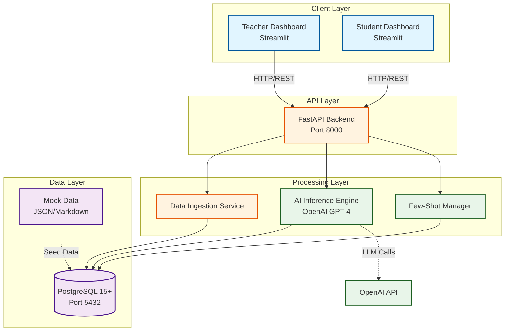

---

## Technology Stack

### Core Technologies

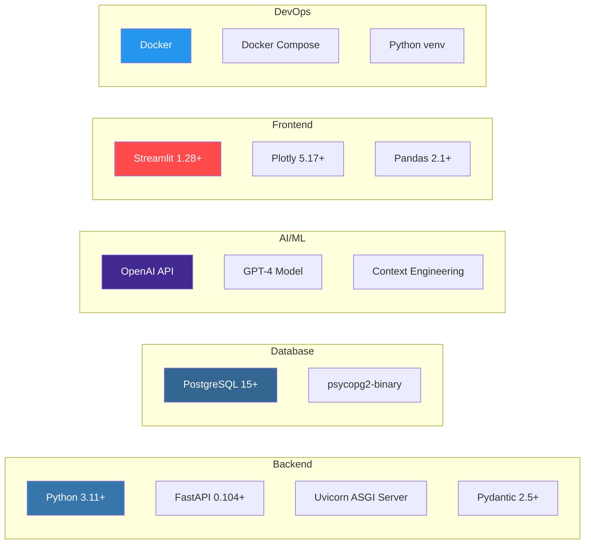

| Layer | Technology | Version | Purpose |
|-------|-----------|---------|---------|
| **Backend API** | FastAPI | 0.104.1+ | RESTful API framework |
| **Database** | PostgreSQL | 15+ | Relational data storage |
| **AI Engine** | OpenAI GPT-4 | Latest | LLM-based skill inference |
| **Frontend** | Streamlit | 1.28+ | Rapid UI prototyping |
| **Containerization** | Docker | Latest | Development environment |
| **Language** | Python | 3.11+ | Primary programming language |

---

## Component Architecture

### High-Level Component Diagram

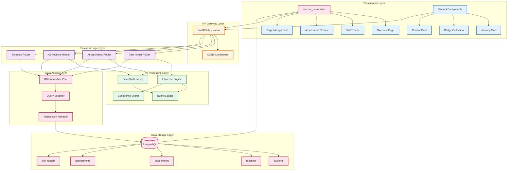

---

## Data Flow Architecture

### End-to-End Data Flow

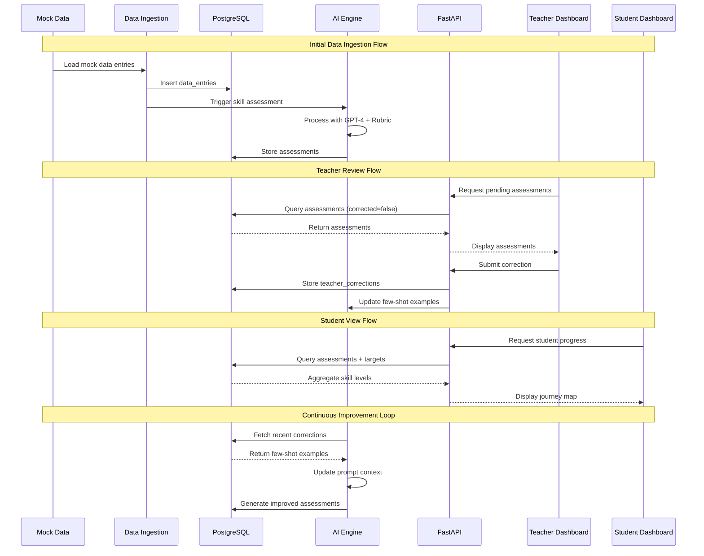

### Assessment Generation Pipeline

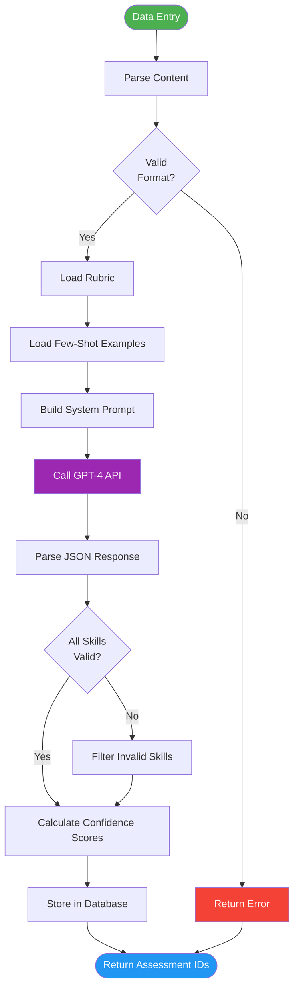

---

## Database Architecture

### Entity Relationship Diagram

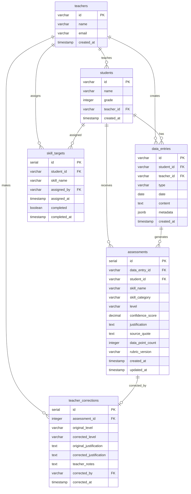

### Database Schema Details

For detailed database schema including indexes, constraints, and optimization strategies, see [ARCHITECTURE_DATABASE.md](./ARCHITECTURE_DATABASE.md)

---

## AI Pipeline Architecture

### AI Inference Engine Components

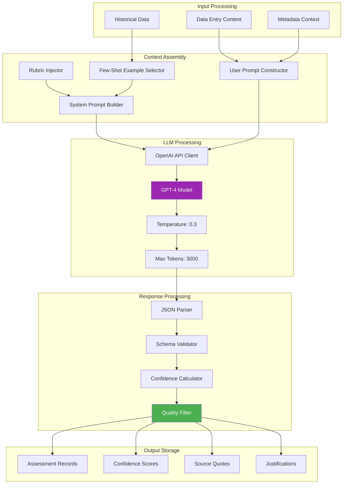

### Few-Shot Learning Loop

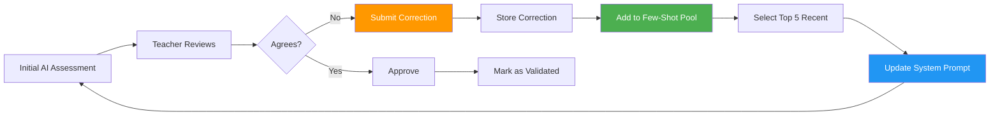

For detailed AI architecture including prompt engineering and model optimization, see [ARCHITECTURE_AI.md](./ARCHITECTURE_AI.md)

---

## API Architecture

### API Endpoint Structure

```mermaid
graph TB
    subgraph "API Gateway"
        Root[/ Root Endpoint]
        Health[/health Health Check]
    end

    subgraph "Data Management"
        DI[/api/data/ingest<br/>POST]
        DB[/api/data/batch<br/>POST]
    end

    subgraph "Assessment Endpoints"
        AS[/api/assessments/student/:id<br/>GET]
        AT[/api/assessments/skill-trends/:id<br/>GET]
        AP[/api/assessments/pending<br/>GET]
        AA[/api/assessments/:id/approve<br/>POST]
    end

    subgraph "Correction Endpoints"
        CS[/api/corrections/submit<br/>POST]
        CG[/api/corrections/history/:id<br/>GET]
    end

    subgraph "Student Endpoints"
        SL[/api/students<br/>GET]
        SG[/api/students/:id<br/>GET]
        SP[/api/students/:id/progress<br/>GET]
        SB[/api/students/:id/badges<br/>GET]
        ST[/api/students/:id/target-skill<br/>POST]
    end

    Root --> Health

    DI --> Ingest[Data Ingest Service]
    DB --> Ingest

    AS --> Query[Query Service]
    AT --> Trend[Trend Analysis]
    AP --> Review[Review Service]
    AA --> Approve[Approval Service]

    CS --> Correction[Correction Service]
    CG --> History[History Service]

    SL --> Student[Student Service]
    SG --> Student
    SP --> Progress[Progress Service]
    SB --> Badge[Badge Service]
    ST --> Target[Target Service]

    classDef gateway fill:#e1f5ff,stroke:#01579b
    classDef data fill:#fff3e0,stroke:#e65100
    classDef assessment fill:#f3e5f5,stroke:#4a148c
    classDef correction fill:#e8f5e9,stroke:#1b5e20
    classDef student fill:#fce4ec,stroke:#c2185b

    class Root,Health gateway
    class DI,DB data
    class AS,AT,AP,AA assessment
    class CS,CG correction
    class SL,SG,SP,SB,ST student
```

### Request/Response Flow

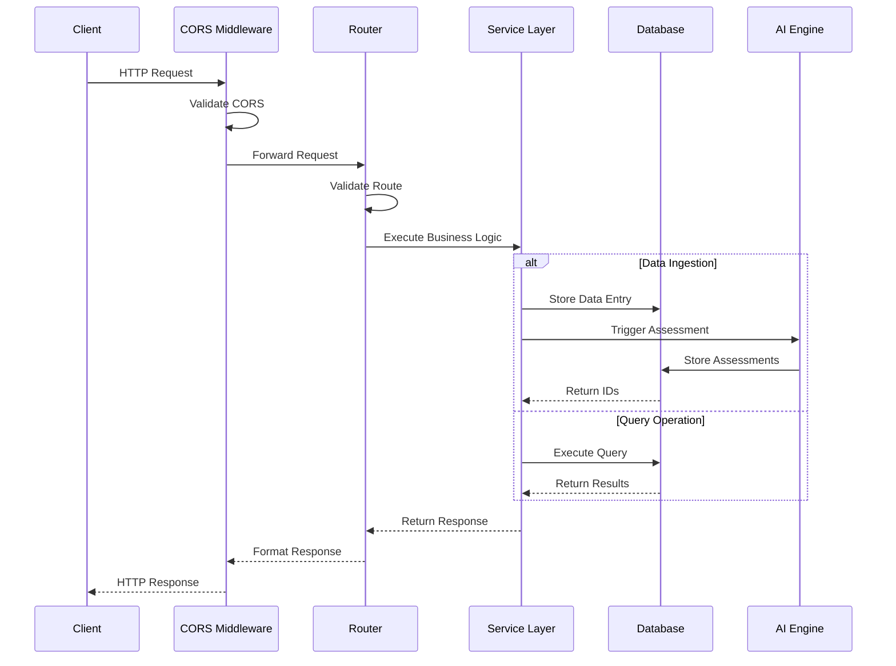

For detailed API specifications including all endpoints and schemas, see [ARCHITECTURE_API.md](./ARCHITECTURE_API.md)

---

## Frontend Architecture

### Dashboard Component Structure

```mermaid
graph TB
    subgraph "Teacher Dashboard"
        TH[Home.py<br/>Main Entry]

        TH --> T1[01_Student_Overview.py]
        TH --> T2[02_Skill_Trends.py]
        TH --> T3[03_Assessment_Review.py]
        TH --> T4[04_Target_Assignment.py]

        T1 --> TU1[Student Cards]
        T1 --> TU2[Growth Indicators]

        T2 --> TU3[Trend Charts]
        T2 --> TU4[Timeline Views]

        T3 --> TU5[Assessment List]
        T3 --> TU6[Correction Form]
        T3 --> TU7[Rubric Reference]

        T4 --> TU8[Target Selector]
        T4 --> TU9[Suggestion Engine]
    end

    subgraph "Student Dashboard"
        SH[Student_Home.py]

        SH --> S1[Student_01_Journey_Map.py]
        SH --> S2[Student_02_Badge_Collection.py]
        SH --> S3[Student_03_Current_Goal.py]

        S1 --> SU1[Progress Bars]
        S1 --> SU2[Level Indicators]

        S2 --> SU3[Badge Grid]
        S2 --> SU4[Achievement Display]

        S3 --> SU5[Goal Card]
        S3 --> SU6[Tips Display]
    end

    subgraph "Shared Utilities"
        U1[api_client.py<br/>Backend API Wrapper]
        U2[chart_helpers.py<br/>Visualization Utils]
        U3[session_manager.py<br/>State Management]
    end

    TU1 --> U1
    TU3 --> U2
    SU1 --> U2
    T3 --> U3
    S1 --> U3

    classDef teacher fill:#e3f2fd,stroke:#1565c0,stroke-width:2px
    classDef student fill:#fff3e0,stroke:#ef6c00,stroke-width:2px
    classDef shared fill:#f3e5f5,stroke:#6a1b9a,stroke-width:2px

    class TH,T1,T2,T3,T4,TU1,TU2,TU3,TU4,TU5,TU6,TU7,TU8,TU9 teacher
    class SH,S1,S2,S3,SU1,SU2,SU3,SU4,SU5,SU6 student
    class U1,U2,U3 shared
```

### UI State Management

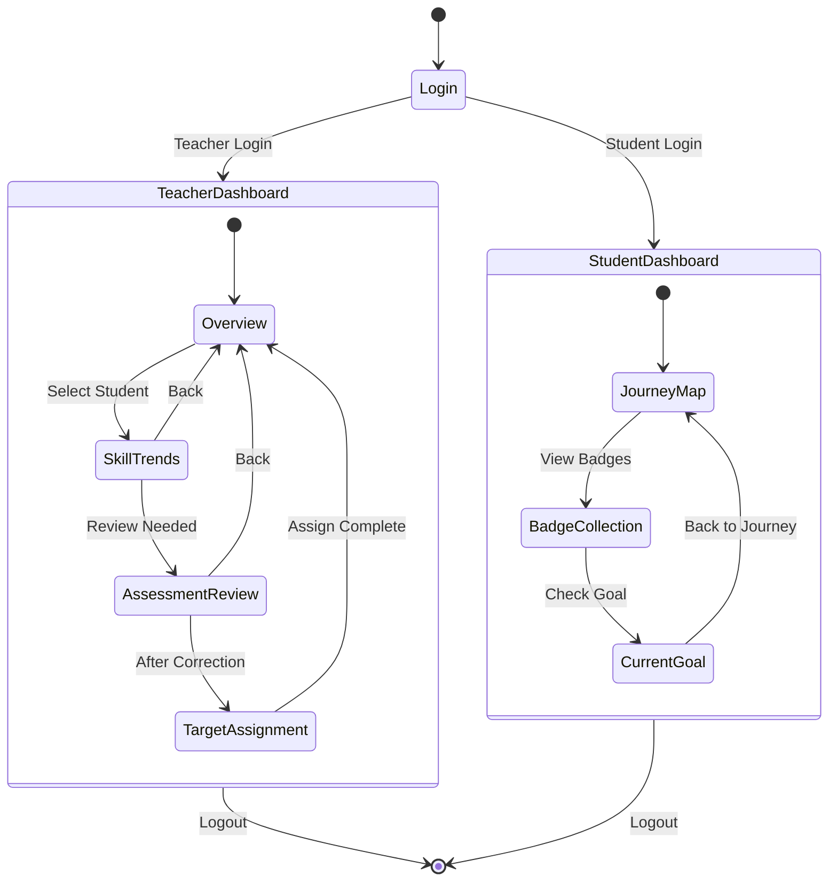

For detailed frontend architecture including component specifications, see [ARCHITECTURE_FRONTEND.md](./ARCHITECTURE_FRONTEND.md)

---

## Deployment Architecture

### Docker Compose Architecture

```mermaid
graph TB
    subgraph "Docker Host"
        subgraph "Frontend Container"
            F[Streamlit App<br/>Port 8501]
            FV[/app Volume Mount]
        end

        subgraph "Backend Container"
            B[FastAPI App<br/>Port 8000]
            BV1[/app Volume Mount]
            BV2[/mock_data Volume Mount]
        end

        subgraph "Database Container"
            D[(PostgreSQL 15<br/>Port 5432)]
            DV[postgres_data Volume]
        end

        subgraph "External Services"
            O[OpenAI API<br/>HTTPS]
        end
    end

    F -->|HTTP| B
    B -->|TCP| D
    B -.->|HTTPS| O

    FV -.->|Source Code| F
    BV1 -.->|Source Code| B
    BV2 -.->|Mock Data| B
    DV -.->|Persistent Data| D

    style F fill:#ff4b4b,color:#fff
    style B fill:#009688,color:#fff
    style D fill:#336791,color:#fff
    style O fill:#412991,color:#fff
```

### Environment Configuration

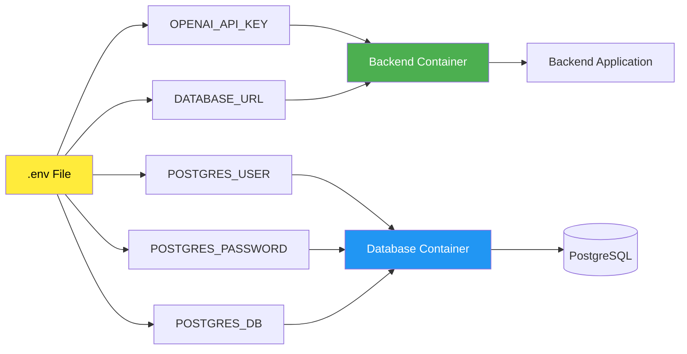

### Network Architecture

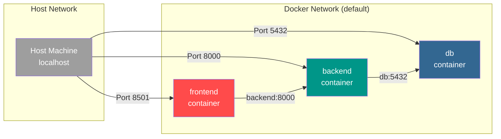

For detailed deployment configurations and scaling strategies, see [ARCHITECTURE_DEPLOYMENT.md](./ARCHITECTURE_DEPLOYMENT.md)

---

## Security Architecture

### Security Layers

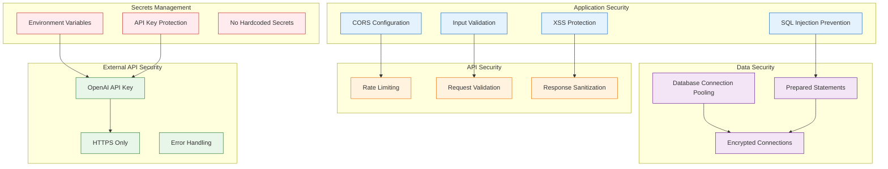

### Data Flow Security

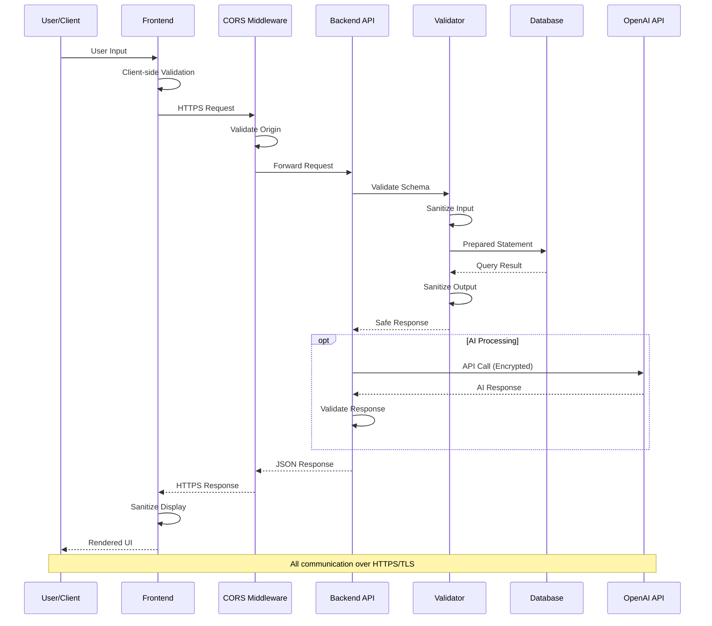

---

## Implementation Shard Mapping

This architecture is implemented through the following shards:

| Shard | Component Coverage | Architecture Document |
|-------|-------------------|----------------------|
| **Shard 1** | Database Infrastructure | [ARCHITECTURE_DATABASE.md](./ARCHITECTURE_DATABASE.md) |
| **Shard 2** | Mock Data Generation | [ARCHITECTURE_DATA_GENERATION.md](./ARCHITECTURE_DATA_GENERATION.md) |
| **Shard 3** | AI Inference Pipeline | [ARCHITECTURE_AI.md](./ARCHITECTURE_AI.md) |
| **Shard 4** | Backend API | [ARCHITECTURE_API.md](./ARCHITECTURE_API.md) |
| **Shard 5** | Teacher Dashboard | [ARCHITECTURE_FRONTEND_TEACHER.md](./ARCHITECTURE_FRONTEND_TEACHER.md) |
| **Shard 6** | Student Dashboard | [ARCHITECTURE_FRONTEND_STUDENT.md](./ARCHITECTURE_FRONTEND_STUDENT.md) |
| **Shard 7** | Data Ingestion & Testing | [ARCHITECTURE_TESTING.md](./ARCHITECTURE_TESTING.md) |
| **Shard 8** | Integration & Validation | [ARCHITECTURE_INTEGRATION.md](./ARCHITECTURE_INTEGRATION.md) |

---

## Key Architectural Decisions

### 1. Microservices vs Monolithic
**Decision:** Modular monolith with clear separation of concerns
**Rationale:**
- MVP scope allows for single deployment
- Clear module boundaries enable future microservices split
- Simplified development and debugging

### 2. Streamlit vs React
**Decision:** Streamlit for MVP frontend
**Rationale:**
- 80% faster development time
- Python-native integration with backend
- Sufficient for demo and validation
- Can be replaced with React for production

### 3. Context Engineering vs Fine-Tuning
**Decision:** Context engineering with few-shot learning
**Rationale:**
- No labeled training data available initially
- More flexible and faster to iterate
- Teacher corrections build training dataset over time
- Can transition to fine-tuning with sufficient data

### 4. PostgreSQL vs NoSQL
**Decision:** PostgreSQL relational database
**Rationale:**
- Structured data with clear relationships
- Complex queries for trend analysis
- ACID compliance for corrections
- Mature ecosystem and tooling

### 5. Docker vs Cloud Deployment
**Decision:** Docker Compose for MVP
**Rationale:**
- Faster local development setup
- Lower costs for initial development
- Easier debugging and iteration
- Clear path to Kubernetes/cloud deployment

---

## Performance Considerations

### Target Metrics

| Metric | Target | Monitoring |
|--------|--------|-----------|
| API Response Time | < 2s | FastAPI logging |
| Assessment Generation | < 5s per entry | OpenAI API timing |
| Database Query | < 500ms | PostgreSQL EXPLAIN |
| Dashboard Load | < 3s | Streamlit profiling |
| Teacher Agreement Rate | ≥ 85% | Manual validation |

### Optimization Strategies

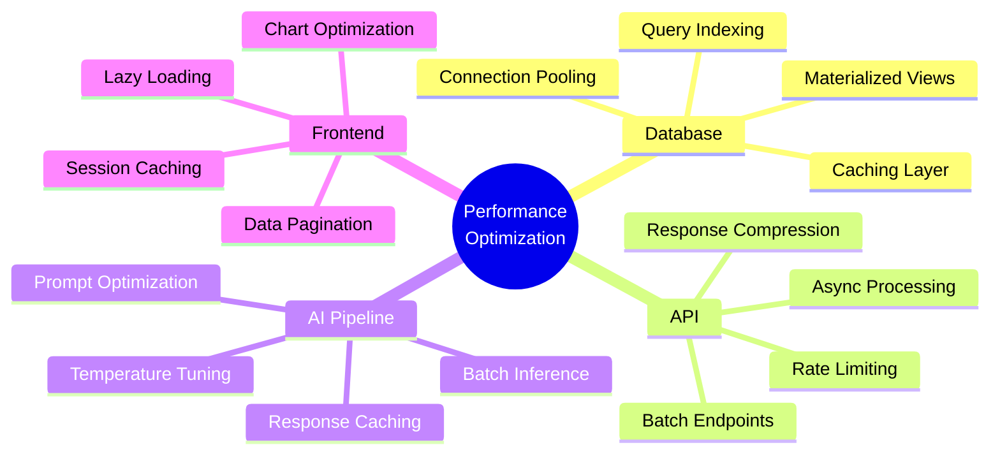

---

## Scalability Roadmap

### MVP → Production Evolution

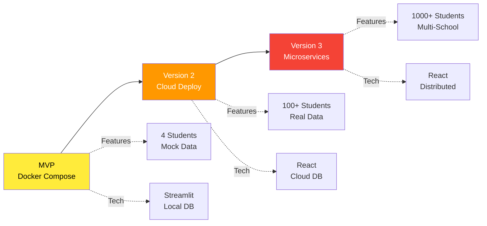

---

## Appendix: System Diagrams

### Project Structure

```
flourish-skills-tracker/
├── backend/                    # FastAPI backend application
│   ├── ai/                    # AI inference components
│   ├── database/              # Database schemas & connections
│   ├── routers/               # API endpoint routers
│   └── models/                # Pydantic data models
├── frontend/                  # Streamlit dashboard applications
│   ├── pages/                 # Dashboard page components
│   └── utils/                 # Shared utilities
├── mock_data/                 # Mock data for MVP
├── scripts/                   # Utility scripts
├── Architecture/              # Architecture documentation (this folder)
└── Implementation_Shards/     # Implementation task breakdown
```

---

## Contact & Documentation

**Project Documentation:**
- Architecture Overview (this document)
- [Implementation Roadmap](../Implementation_Shards/IMPLEMENTATION_ROADMAP.md)
- [Master Task Tracker](../Implementation_Shards/MASTER_TASK_TRACKER.md)
- [Product Requirements Document](../Docs/PRD.md)

**For detailed component architecture, refer to the specific architecture documents listed in the Implementation Shard Mapping section above.**

---

**Document Version:** 1.0
**Last Updated:** November 10, 2025
**Maintained By:** Flourish Schools Engineering Team
