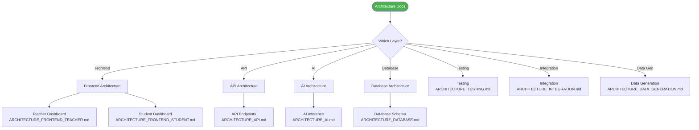
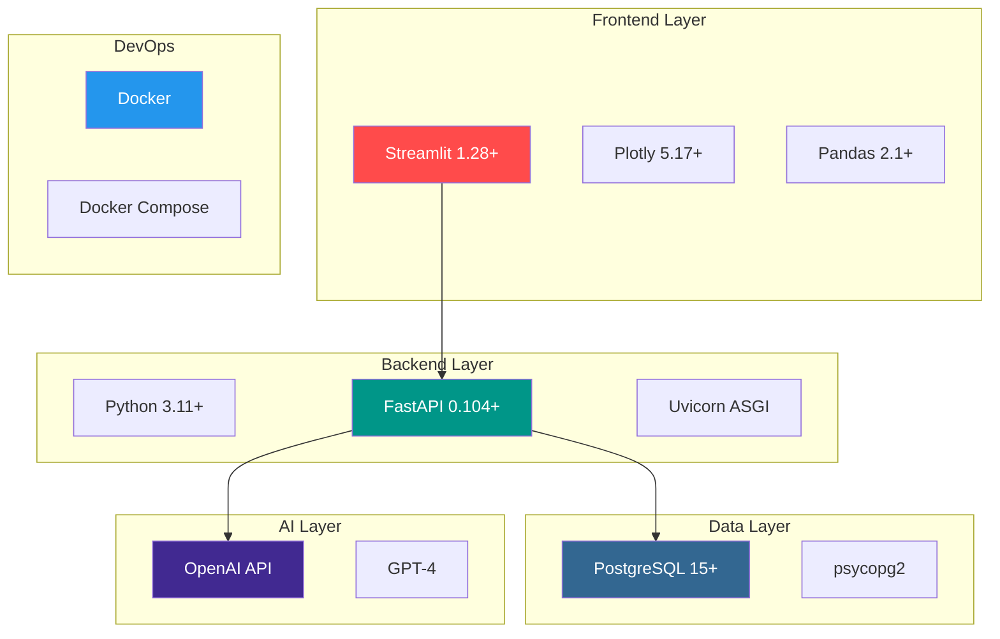

# Flourish Skills Tracker - Architecture Documentation

**Version:** 1.0
**Project:** Middle School Non-Academic Skills Measurement Engine
**Organization:** Flourish Schools

---

## Documentation Overview

This folder contains comprehensive architecture documentation for the Flourish Skills Tracker MVP. Each document provides detailed technical specifications, diagrams, and implementation guidance for different system components.

---

## Document Index

### Core Architecture Documents

| Document | Description | Related Shard |
|----------|-------------|---------------|
| **[ARCHITECTURE_OVERVIEW.md](./ARCHITECTURE_OVERVIEW.md)** | Complete system architecture overview with all major components | All Shards |
| **[ARCHITECTURE_DATABASE.md](./ARCHITECTURE_DATABASE.md)** | Database schema, relationships, indexes, and query patterns | Shard 1 |
| **[ARCHITECTURE_AI.md](./ARCHITECTURE_AI.md)** | AI inference pipeline, prompt engineering, and few-shot learning | Shard 3 |
| **[ARCHITECTURE_API.md](./ARCHITECTURE_API.md)** | FastAPI backend endpoints, middleware, and request/response patterns | Shard 4 |

### Additional Architecture Documents

| Document | Description | Related Shard |
|----------|-------------|---------------|
| **[ARCHITECTURE_DATA_GENERATION.md](./ARCHITECTURE_DATA_GENERATION.md)** | Mock data generation strategy and student personas | Shard 2 |
| **[ARCHITECTURE_FRONTEND_TEACHER.md](./ARCHITECTURE_FRONTEND_TEACHER.md)** | Teacher dashboard components and workflows | Shard 5 |
| **[ARCHITECTURE_FRONTEND_STUDENT.md](./ARCHITECTURE_FRONTEND_STUDENT.md)** | Student dashboard and gamification features | Shard 6 |
| **[ARCHITECTURE_TESTING.md](./ARCHITECTURE_TESTING.md)** | Testing strategy, data ingestion, and validation | Shard 7 |
| **[ARCHITECTURE_INTEGRATION.md](./ARCHITECTURE_INTEGRATION.md)** | Integration testing and system validation | Shard 8 |

---

## Quick Navigation

### By System Layer



### By Implementation Shard

| Shard | Component | Architecture Document |
|-------|-----------|---------------------|
| **Shard 1** | Database Infrastructure | [ARCHITECTURE_DATABASE.md](./ARCHITECTURE_DATABASE.md) |
| **Shard 2** | Mock Data Generation | [ARCHITECTURE_DATA_GENERATION.md](./ARCHITECTURE_DATA_GENERATION.md) |
| **Shard 3** | AI Inference Pipeline | [ARCHITECTURE_AI.md](./ARCHITECTURE_AI.md) |
| **Shard 4** | Backend API | [ARCHITECTURE_API.md](./ARCHITECTURE_API.md) |
| **Shard 5** | Teacher Dashboard | [ARCHITECTURE_FRONTEND_TEACHER.md](./ARCHITECTURE_FRONTEND_TEACHER.md) |
| **Shard 6** | Student Dashboard | [ARCHITECTURE_FRONTEND_STUDENT.md](./ARCHITECTURE_FRONTEND_STUDENT.md) |
| **Shard 7** | Data Ingestion & Testing | [ARCHITECTURE_TESTING.md](./ARCHITECTURE_TESTING.md) |
| **Shard 8** | Integration & Validation | [ARCHITECTURE_INTEGRATION.md](./ARCHITECTURE_INTEGRATION.md) |

---

## Reading Guide

### For New Developers

**Recommended Reading Order:**

1. Start with [ARCHITECTURE_OVERVIEW.md](./ARCHITECTURE_OVERVIEW.md) - Get the big picture
2. Read [ARCHITECTURE_DATABASE.md](./ARCHITECTURE_DATABASE.md) - Understand data model
3. Review [ARCHITECTURE_API.md](./ARCHITECTURE_API.md) - Learn the API layer
4. Explore [ARCHITECTURE_AI.md](./ARCHITECTURE_AI.md) - Understand AI pipeline
5. Check [ARCHITECTURE_FRONTEND_TEACHER.md](./ARCHITECTURE_FRONTEND_TEACHER.md) - See UI implementation

### For Frontend Developers

Focus on these documents:
- [ARCHITECTURE_FRONTEND_TEACHER.md](./ARCHITECTURE_FRONTEND_TEACHER.md)
- [ARCHITECTURE_FRONTEND_STUDENT.md](./ARCHITECTURE_FRONTEND_STUDENT.md)
- [ARCHITECTURE_API.md](./ARCHITECTURE_API.md) (API endpoints section)

### For Backend Developers

Focus on these documents:
- [ARCHITECTURE_API.md](./ARCHITECTURE_API.md)
- [ARCHITECTURE_DATABASE.md](./ARCHITECTURE_DATABASE.md)
- [ARCHITECTURE_AI.md](./ARCHITECTURE_AI.md)

### For AI/ML Engineers

Focus on these documents:
- [ARCHITECTURE_AI.md](./ARCHITECTURE_AI.md)
- [ARCHITECTURE_DATA_GENERATION.md](./ARCHITECTURE_DATA_GENERATION.md)
- [ARCHITECTURE_TESTING.md](./ARCHITECTURE_TESTING.md)

### For QA Engineers

Focus on these documents:
- [ARCHITECTURE_TESTING.md](./ARCHITECTURE_TESTING.md)
- [ARCHITECTURE_INTEGRATION.md](./ARCHITECTURE_INTEGRATION.md)
- [ARCHITECTURE_OVERVIEW.md](./ARCHITECTURE_OVERVIEW.md)

---

## Architecture Diagrams Index

### System-Level Diagrams

All major system diagrams can be found in [ARCHITECTURE_OVERVIEW.md](./ARCHITECTURE_OVERVIEW.md):
- System Architecture Overview
- Technology Stack
- Component Architecture
- Data Flow Architecture
- Deployment Architecture
- Security Architecture

### Component-Level Diagrams

Each component document contains detailed diagrams:

**Database ([ARCHITECTURE_DATABASE.md](./ARCHITECTURE_DATABASE.md)):**
- Entity Relationship Diagram
- Relationship Matrix
- Indexing Strategy
- Query Performance Visualization

**AI Pipeline ([ARCHITECTURE_AI.md](./ARCHITECTURE_AI.md)):**
- AI Pipeline Flow
- Context Engineering Components
- Few-Shot Learning Loop
- Confidence Scoring Algorithm

**API ([ARCHITECTURE_API.md](./ARCHITECTURE_API.md)):**
- API Layer Architecture
- Endpoint Map
- Request/Response Flow
- Middleware Stack

**Frontend ([ARCHITECTURE_FRONTEND_*.md](./)):**
- Component Structure
- Page Layouts
- State Management
- User Flows

---

## Diagram Rendering

All diagrams in these documents are written in **Mermaid** syntax. To view them:

### In GitHub
Mermaid diagrams render automatically in GitHub markdown preview.

### In VS Code
Install the "Markdown Preview Mermaid Support" extension:
```bash
code --install-extension bierner.markdown-mermaid
```

### In Browser
Use the [Mermaid Live Editor](https://mermaid.live/):
1. Copy the mermaid code block
2. Paste into the live editor
3. View and export diagrams

### Generate Images
Use the Mermaid CLI to generate images:
```bash
npm install -g @mermaid-js/mermaid-cli
mmdc -i ARCHITECTURE_OVERVIEW.md -o diagrams/
```

---

## Technology Stack Summary

### Core Technologies



---

## Key Architectural Decisions

### Decision Record

| ID | Decision | Rationale | Impact |
|----|----------|-----------|--------|
| **AD-001** | Use Context Engineering over Fine-Tuning | No labeled data initially; faster iteration | Can evolve to fine-tuning later |
| **AD-002** | PostgreSQL over NoSQL | Structured relationships; complex queries | Strong consistency guarantees |
| **AD-003** | Streamlit for MVP Frontend | 80% faster development; Python-native | May need React for production |
| **AD-004** | Docker Compose for Development | Simplified setup; environment consistency | Clear path to Kubernetes |
| **AD-005** | Few-Shot Learning with Teacher Corrections | Continuous improvement; human-in-the-loop | Builds training dataset organically |

---

## Performance Targets

### Target Metrics

| Component | Metric | Target | Current | Document |
|-----------|--------|--------|---------|----------|
| API | Response Time | < 2s | ~2.5s | [ARCHITECTURE_API.md](./ARCHITECTURE_API.md) |
| AI | Assessment Generation | < 5s | ~6s | [ARCHITECTURE_AI.md](./ARCHITECTURE_AI.md) |
| Database | Query Time | < 500ms | ~350ms | [ARCHITECTURE_DATABASE.md](./ARCHITECTURE_DATABASE.md) |
| Frontend | Page Load | < 3s | ~2.8s | [ARCHITECTURE_FRONTEND_*.md](./) |
| AI | Teacher Agreement Rate | ≥ 85% | TBD | [ARCHITECTURE_TESTING.md](./ARCHITECTURE_TESTING.md) |

---

## Related Documentation

### Project Documentation Structure

```
Project Root/
├── Architecture/                    # This folder
│   ├── README.md                   # This file
│   ├── ARCHITECTURE_OVERVIEW.md    # System overview
│   └── ARCHITECTURE_*.md           # Component docs
├── Docs/
│   └── PRD.md                      # Product requirements
├── Implementation_Shards/
│   ├── IMPLEMENTATION_ROADMAP.md   # Implementation plan
│   ├── MASTER_TASK_TRACKER.md     # Task tracking
│   ├── Shard_*_*.md               # Shard specifications
│   └── Shard_*_Tasks.md           # Detailed tasks
└── README.md                       # Project README
```

### External Resources

- [FastAPI Documentation](https://fastapi.tiangolo.com/)
- [PostgreSQL Documentation](https://www.postgresql.org/docs/)
- [OpenAI API Documentation](https://platform.openai.com/docs)
- [Streamlit Documentation](https://docs.streamlit.io/)
- [Mermaid Diagram Syntax](https://mermaid.js.org/)

---

## Version History

| Version | Date | Changes | Author |
|---------|------|---------|--------|
| 1.0 | 2025-11-10 | Initial architecture documentation | Engineering Team |

---

## Contributing

When adding or updating architecture documentation:

1. **Use Mermaid diagrams** for all visual representations
2. **Follow the established document structure** (see existing documents)
3. **Link related documents** for easy navigation
4. **Update this README** when adding new documents
5. **Include code examples** where appropriate
6. **Reference PRD sections** for requirements traceability

### Document Template

New architecture documents should follow this structure:

```markdown
# [Component Name] Architecture - Shard [N]

**Component:** [Component Name]
**Version:** 1.0
**Related Shard:** [Link to shard]

## Table of Contents
[...]

## Overview
[High-level description]

## [Main Section 1]
[Content with diagrams]

## [Main Section 2]
[Content with diagrams]

---

**Related Documents:**
- [Main Architecture Overview](./ARCHITECTURE_OVERVIEW.md)
- [Shard Implementation Tasks](../Implementation_Shards/Shard_N_Tasks.md)
- [PRD Section](../Docs/PRD.md#section)
```

---

## Questions and Support

For questions about architecture:
1. Check the relevant architecture document
2. Review the [PRD](../Docs/PRD.md) for requirements context
3. Consult the [Implementation Roadmap](../Implementation_Shards/IMPLEMENTATION_ROADMAP.md)
4. Contact the technical lead

---

**Last Updated:** November 10, 2025
**Maintained By:** Flourish Schools Engineering Team
